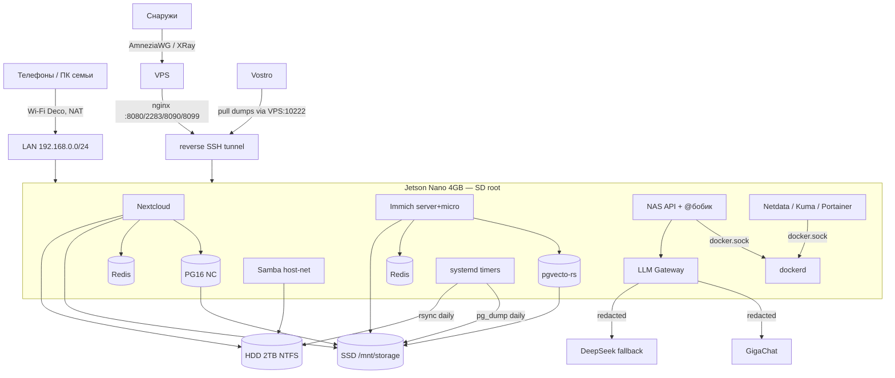

# NAS_Jetson_Nano — Full Technical Audit (2026-09-19)

> 🇷🇺 Основной отчёт. Английское резюме — [`EXECUTIVE_SUMMARY_EN.md`](EXECUTIVE_SUMMARY_EN.md).
> 🇬🇧 Main report (Russian). English summary — [`EXECUTIVE_SUMMARY_EN.md`](EXECUTIVE_SUMMARY_EN.md).
>
> **Метод:** мастер-промпт `docs/research/Master Prompt — полный аудит и план развития NAS_Jetson_Nano.md`.
> **Режим:** READ-ONLY. На Jetson и VPS ничего не менялось: ни рестартов, ни записи, ни установки пакетов.
> Код анализировался на изолированных копиях (HEAD, staged, рабочее дерево) во временном каталоге,
> рабочее дерево репозитория не трогалось — там параллельно работает GigaCode.
> **Замеры:** 2026-09-19 03:33–03:45 UTC. Все числа ниже — на это время, если не указано иное.
> **Доказательства:** [`EVIDENCE_2026-09-19.md`](EVIDENCE_2026-09-19.md). **Findings:** [`FINDINGS_2026-09-19.md`](FINDINGS_2026-09-19.md). **План:** [`ROADMAP_2026-09-19.md`](ROADMAP_2026-09-19.md).
>
> Классы достоверности: **CONFIRMED** (замерено/исполнено), **PROBABLE**, **HYPOTHESIS**, **NOT VERIFIED**.
> Приоритеты: P0 критично · P1 высокий · P2 средний · P3 низкий · P4 улучшение.

---

## 1. Executive Summary

**1. Что это за система сейчас.** Семейное частное облако на Jetson Nano 4 ГБ (L4T R32.7.1,
Ubuntu 18.04, ядро 4.9): 13 контейнеров (Nextcloud 33.0.4, Immich 2.7.5, Samba, два Postgres,
два Redis, LLM Gateway, NAS API с Talk-ботом `@бобик`, Netdata, Uptime Kuma, Portainer). Данные:
SSD 229 ГБ (БД + фото Immich 13 ГБ), HDD 2 ТБ NTFS (семейный архив 1.4 ТБ + копия Immich),
корень и весь Docker — на SD-карте 64 ГБ. Внешний доступ — только через VPN и обратный SSH-туннель
на VPS. Система **работает и здорова по основным показателям**: все контейнеры healthy,
рестартов 0, OOM 0, USB-ошибок 0, SMART HDD чист, дампы БД свежие (19.09 03:01).

**2. Что сделано технически хорошо.** Закалка USB-хранилища (quirks, 0 ошибок), fail-closed дампы
с `gzip -t` и порогом размера, минимальная внешняя поверхность (VPS: наружу только 22/443/40568,
остальное — только из VPN), единая «дверь» к внешним LLM с редактированием ПДн и бюджетом,
лимиты памяти на всех контейнерах, ADR-практика и культура «отзывать ошибочные диагнозы».

**3. Самые серьёзные проблемы.**
- 🔴 **Незакоммиченный код GigaCode ломает `@бобик` целиком** (CONFIRMED исполнением): в staged-версии
  шлюза `chat()` обращается к `full` до её определения → **каждый запрос к GigaChat (провайдер по
  умолчанию) отдаёт HTTP 500**; в текущей WIP-правке удалено `_IMG_TAG_RE`, которое ещё используется
  (генерация картинок упадёт с `NameError`); 2 существующих теста падают. На устройство **не выкачено**.
  Это блокер любого деплоя (Stage 0).
- 🔴 **Авто-восстановление SSD сломано с 2026-09-08** (CONFIRMED): на устройство подтянуто 98 коммитов
  с переименованием, скрипт зовёт `/home/admin/nas_jetson_nano/.../storage_preflight.sh`, а репозиторий
  лежит в `~/nasa` → код 127. Юнит в состоянии `failed` с 18.09 13:57, документация пишет «✅ active».
- 🟠 **Питание:** 18.09 плата была обесточена ~3.5 ч (`PMC reset source: TEGRA_POWER_ON_RESET`,
  журнал обрывается без остановки). Второй подтверждённый аппаратный сброс после 17.08. ИБП нет.
- 🟠 **Бэкап неполон:** файлы Nextcloud (260 МБ), `config.php` Nextcloud, `.env` с секретами и все
  Docker-тома на SD **не копируются никуда**; фото Immich есть только дома (SSD + HDD);
  HDD-копия доступна на запись всем членам семьи через Samba/Nextcloud.
- 🟠 **Безопасность в LAN/VPN:** NAS API отдаёт без авторизации список комнат Talk с участниками, логи
  и контейнеры, при этом `CORS *` — любая веб-страница в браузере домочадца может их прочитать
  (CONFIRMED). Шлюз LLM без аутентификации, с произвольным `save_path` в живом контейнере,
  подменяемым `user` для квот и fail-open бюджетом (CONFIRMED исполнением на HEAD).

**4. Что ограничивает развитие.** Не железо, а (а) **полупереехавшее устройство** (git на новом
именовании, systemd и пути на старом), (б) SD-карта как носитель корня и Docker (≈8 ГБ записи в
сутки), (в) EOL-платформа (Ubuntu 18.04 / JetPack 4.6 — последняя для Nano), (г) красный CI уже
35 прогонов подряд — ворота качества перестали быть сигналом.

**5. Что даст максимальный эффект (5–10 действий).**
1. Не коммитить и не выкатывать текущую правку шлюза, пока `chat()` не исправлен и не прошёл весь набор тестов.
2. Починить путь в `ssd_hotplug_recovery.sh` (параметризовать каталог проекта) и проверить на устройстве.
3. Закрыть без-авторизационные эндпоинты NAS API и убрать `CORS *`.
4. Ввести сервисный токен для LLM Gateway, ограничить `save_path`, привязать квоту к аутентифицированному вызывающему.
5. Ротация Docker-логов + перенос тяжёлых писателей (Netdata, Redis, Kuma, логи) с SD на SSD.
6. Бэкап конфигурации: зашифрованный архив `.env` + `config.php` + томов на HDD и off-site.
7. ИБП (или хотя бы детектор пропадания питания) — есть два подтверждённых обесточивания.
8. Изолировать HDD-копию от семейных шар (read-only для людей, запись — только таймеру).
9. Починить два shell-скрипта с битым heredoc и вернуть CI в зелёное.
10. Закрепить версии образов (`release`/`latest` → конкретные теги) до следующего `pull`.

---

## 2. Что представляет собой проект

Репозиторий: 426 отслеживаемых файлов, из них 241 документ, 29 Python-файлов (~5 тыс. строк),
62 shell-скрипта, 17 systemd-сервисов и 12 таймеров, 18 compose-файлов, 11 ADR, 3 CI-workflow.
Язык кода — Python 3.12 (в контейнерах) и bash; хост — Python 3.6.9.

Источники истины по приоритету (как установлено): `AGENTS.md` → ADR-0001…0011 →
`docs/plans/DEVELOPMENT_PLAN_2026-09_SBER_ERA.md` (канон развития) → `CLAUDE.md` (операционное
состояние) → код/compose → устройство. **Устройство расходится с репозиторием** (§22).

| Компонент | Назначение | Технология | Где | Состояние (19.09) | Критичность |
|---|---|---|---|---|---|
| Nextcloud | файлы, Talk, календари | `nextcloud:apache` 33.0.4 + PG16 + Redis | Jetson | healthy, 286 МБ | высокая |
| Immich | фото/видео | `immich-server:release` (2.7.5), pgvecto-rs PG16, Redis; ML выключен | Jetson | healthy, 979 МБ (server+micro) | высокая |
| Samba | SMB-шары | `crazymax/samba:latest`, host network | Jetson | healthy | средняя |
| LLM Gateway | единый выход к LLM, редактирование ПДн, бюджет | FastAPI, собственный образ | Jetson :8090 | healthy, 83 МБ | средняя |
| NAS API + `@бобик` | API статуса/действий, Talk-бот | FastAPI, docker.sock | Jetson :8099 | healthy, 80 МБ | средняя |
| Netdata / Uptime Kuma / Portainer | мониторинг/управление | `:latest`, `:1` | Jetson | healthy | низкая |
| Beszel agent | метрики → hub на VPS | systemd | Jetson :45876 | active | низкая |
| systemd-таймеры | бэкап, HDD-копия, SMART, USB, отчёты, алерты | bash/python | Jetson | 9 таймеров active; `nasa-ssd-recovery` **failed** | высокая |
| Обратный туннель | внешний доступ | autossh → VPS | Jetson↔VPS | ESTAB | высокая |
| VPS | edge: nginx, Beszel hub, AmneziaWG/XRay | Docker, ufw | Франкфурт | up 74 д, 19 пиров | высокая |
| Vostro | off-site дампов (restic, pull) | restic | корп. LAN | последний забор 19.09 01:05 UTC | средняя |
| ROG | пилот Immich ML | Docker Desktop | станция | заблокирован (гипервизор) | нет в prod |

---

## 3. Фактическая архитектура



### 3.1. Compute plane
- **Jetson:** всё боевое. GPU не используется (`GR3D_FREQ 0%`), режим питания MAXN.
- **VPS:** nginx (host network), Beszel hub, AmneziaWG + XRay (VPN ~19 пиров), конец обратного туннеля.
- **Vostro:** restic-репозиторий дампов (pull). По ADR-0007 «вне архитектуры», но **это единственный работающий off-site**.
- **ROG/станция:** вне prod (ADR-0007); пилот Immich ML заблокирован.

### 3.2. Storage plane

| Данные | Где | Копии |
|---|---|---|
| БД Immich/Nextcloud | SSD `/mnt/storage/db` (360 МБ) | дамп ежедневно на SSD (7 шт.) + pull на Vostro |
| Оригиналы Immich + thumbs + encoded | SSD `/mnt/storage/immich/library` (13 ГБ) | rsync на HDD ежедневно (13 ГБ, без `--delete`) |
| Файлы Nextcloud | SSD `/mnt/storage/nextcloud/data` (260 МБ) | **нет** |
| Семейный архив | HDD NTFS (1.4 ТБ) | **нет в проекте** (NOT VERIFIED вне проекта) |
| Nextcloud app/config.php | Docker-том на **SD** (1.1 ГБ) | **нет** |
| Netdata/Kuma/Portainer/Samba-users/LLM usage/Redis | Docker-тома на **SD** | нет (допустимо, кроме Samba users) |
| `.env` (секреты) | SD `~/nasa/config/.env`, `/opt/nasa/config/.env` | **только на устройстве** |
| Логи | SD: journald 112 МБ, контейнеры 427 МБ, `/var/log` 231 МБ | — |

```text
Фото:   телефон → Immich → SSD(L0) → rsync → HDD(L1, тот же дом) → off-site: НЕТ
БД:     PG → pg_dump → SSD(L1) → pull → Vostro restic(L2)
Файлы NC: клиент → Nextcloud → SSD(L0) → НЕТ
Архив:  Samba/NC → HDD(L0) → НЕТ
```

### 3.3. Network plane — см. §7. ### 3.4. Control plane
systemd-таймеры (бэкап 03:00, HDD-копия 04:30, SMART-самотест пн, JMS583 ежечасно, USB watchdog
3 мин, talk-alert 15 мин, health 6 ч, Telegram-отчёт, баланс Giga), udev → `nasa-ssd-recovery`,
`restart: always` у контейнеров. Алерты: Talk + Telegram. Оркестратора нет — и он не нужен.

---

## 4. Hardware topology

| Узел | Факты |
|---|---|
| Jetson Nano 4 ГБ | L4T R32.7.1, 4.9.253-tegra, MAXN; CPU 41 °C, GPU 41 °C, PMIC 50 °C — троттлинга нет |
| SD 64 ГБ | корень + `/var/lib/docker` (17 ГБ); 42 % занято; ≈4.4 ГБ записано за 13 ч аптайма |
| SSD 233 ГБ (JMS583, USB 3) | ext4, 7 % (14 ГБ); записи за 13 ч — 153 МБ |
| HDD WD20EADS (RTL9201) | NTFS/ntfs-3g, 77 % (438 ГБ свободно), SMART: 3217 ч, 0 переназначенных/ожидающих, самотесты OK |
| Питание | ИБП нет; два подтверждённых обесточивания (17.08, 18.09) |

## 5. Software topology
Ubuntu 18.04.6 (EOL стандартной поддержки), Python хоста 3.6.9, Docker 20.10.7 (EOL-ветка),
Compose v5.1.4, cgroup v1. 13 контейнеров, 32 образа (из них ~20 висячих `<none>`), 11 docker-сетей
(часть — дубли от переименований стеков).

---

## 6. Storage architecture — сильная сторона с двумя дырами

Разделение верное: БД и библиотека — на SSD (Immich прямо требует БД на локальном SSD —
docs.immich.app, проверено 2026-09-19), архив — на HDD, ML выключен. USB-стабильность доказана
нулём ошибок. **Дыры:** (1) авто-восстановление SSD сломано (NAS-STO-001); (2) Docker root на SD —
на ней живёт `config.php` Nextcloud и ~8 ГБ/сутки записи (NAS-PERF-001).

## 7. Network architecture

| Service | Port | Bind | Exposure | Auth | Нужен? |
|---|---:|---|---|---|---|
| Nextcloud | 8080 | 0.0.0.0 | LAN + VPN (через VPS) | да | да |
| Immich | 2283 | 0.0.0.0 | LAN + VPN | да | да |
| LLM Gateway | 8090 | 0.0.0.0 | LAN + VPN | **нет** | да, но с токеном |
| NAS API | 8099 | 0.0.0.0 | LAN + VPN | частично (**6 GET без auth**, `CORS *`) | да |
| Netdata | 19999 | 0.0.0.0 | LAN | **нет** | спорно |
| Uptime Kuma | 3001 | 0.0.0.0 | LAN | да | да |
| Portainer | 9000/9443 | 0.0.0.0 | LAN (+VPN 9443 в ufw) | да, но = root хоста | лучше выключать |
| Samba | 445 | 0.0.0.0 (host net) | LAN (iptables: 445/139 из 192.168.0.0/24) | да | да |
| SSH | 22 | 0.0.0.0 | LAN (+туннель) | ключ **и пароль** | да, без пароля |
| rpcbind | 111 | 0.0.0.0 | LAN | — | нет |
| Beszel agent | 45876 | * | LAN | ключ hub | да |

VPS: публично только 22, 443 (XRay), 40568/udp (AWG); ufw default deny; nginx и Beszel в host
network, поэтому ufw к ним применяется; `DOCKER-USER` пуст, но опубликован только 443 —
**экспозиции нет** (CONFIRMED). Сегментации в доме нет: Wi-Fi гость = доступ ко всем портам выше.

## 8. Data flows
```text
Телефон → Wi-Fi(Deco NAT) → 192.168.0.50:2283 → Immich → PG(SSD) + library(SSD) → rsync HDD 04:30
Телефон снаружи → AmneziaWG → VPS 172.29.172.1:2283 → nginx → туннель → Immich …
Talk-сообщение «@бобик …» → Nextcloud → NAS API (long-poll) → safety gate → Gateway → redact → GigaChat
PG → pg_dump 03:00 → SSD dumps (7 шт.) → Vostro pull ~01:05 следующей ночи (RPO off-site ≈ 22–46 ч)
```

---

## 9. Сильные стороны (TOP-10)

| # | Что сделано хорошо | Почему хорошо | Доказательство | Сохранить |
|---|---|---|---|---|
| S1 | USB-хранилище закалено | главный класс отказов Jetson-NAS закрыт | `usb_err_total=0`, quirks для обоих мостов, SCSI 120 с | quirks и таймеры |
| S2 | Fail-closed дампы БД | пустой дамп больше не выглядит успехом | `backup_databases.sh:10-11,104-110`; дампы 19.09 03:01 20 МБ/2.7 МБ | порог и `gzip -t` |
| S3 | Минимальная внешняя поверхность | сервисы не торчат в интернет | ufw VPS default deny, только 22/443/40568 | правило №4 |
| S4 | Единая дверь к LLM | ПДн редактируются в одном месте | `llm-gateway/app/main.py:40-100`, `raw` запрещён, анализ фото выключен | архитектуру двери |
| S5 | Разделение данных по носителям | БД на SSD, архив на HDD, ML выключен | `findmnt`, compose | принцип |
| S6 | Дисциплина памяти | 4 ГБ хватает | лимиты на всех 13, OOM=0, рестартов 0, доступно 1.5 ГБ | лимиты |
| S7 | Аддитивная HDD-копия | удаление на SSD не стирает копию | `immich_hdd_second_copy.sh:43` — `rsync -a` без `--delete` | не добавлять `--delete` |
| S8 | ADR + двуязычная документация | решения восстановимы через год | 11 ADR, 241 документ | практику |
| S9 | Культура отзыва ошибок | ложные диагнозы не цементируются | «Грабли» в `CLAUDE.md`, `docs/28` §3.3 | — |
| S10 | Широкая наблюдаемость | журнал постоянный, SMART-самотест, JMS583, алерты | journald persistent 112 МБ, таймеры | но см. NAS-OBS-001 |

## 10. Критические проблемы (TOP-10)

Severity ≠ ценность: сортировка по риску.

| # | ID | Проблема | Sev | Conf |
|---|---|---|---|---|
| 1 | NAS-REG-001 | Staged/WIP-код шлюза: каждый чат GigaChat → 500; `_IMG_TAG_RE` удалён | **P0 (блокер деплоя)** | CONFIRMED |
| 2 | NAS-STO-001 | Авто-восстановление SSD сломано переименованием путей | P1 | CONFIRMED |
| 3 | NAS-BAK-001 | Нет копий: файлы NC, `config.php`, `.env`, тома SD; фото без off-site | P1 | CONFIRMED |
| 4 | NAS-SEC-001 | NAS API: 6 GET без auth + `CORS *` → утечка комнат/участников/логов в браузер | P1 | CONFIRMED |
| 5 | NAS-SEC-003 | Gateway: без auth, `save_path`, подменяемый `user`, fail-open бюджет | P1 | CONFIRMED |
| 6 | NAS-REL-001 | Обесточивания без ИБП и без детекции причины | P1 | CONFIRMED |
| 7 | NAS-SEC-002 | NAS API: authN ≠ authZ, любой член семьи рестартует БД; docker.sock | P1 | CONFIRMED (код) |
| 8 | NAS-BAK-002 | HDD-копия доступна на запись через Samba/NC всем пользователям | P1 | CONFIRMED |
| 9 | NAS-PERF-001 | ≈8 ГБ/сутки записи на SD (Docker root, логи без ротации, Netdata, Redis) | P2 | CONFIRMED (объём), HYPOTHESIS (срок жизни SD) |
| 10 | NAS-QA-001 | CI красный 35 прогонов подряд с 2026-08-30; реальные баги в 2 скриптах | P2 | CONFIRMED |

## 11. Security findings (кратко; подробно — FINDINGS)
NAS-SEC-001…009: auth/CORS NAS API; RBAC; шлюз; fallback на 401 в DeepSeek (промпт уходит второму
иностранному провайдеру при ошибке конфигурации — CONFIRMED); SSH с паролем + повторное
использование пароля Nextcloud-админа как sudo; Portainer/Netdata с docker.sock в LAN; rpcbind;
идентификаторы в публичном репозитории (G05 не закрыт); ветка картинок `@бобик` до safety gate
и без лимита размера вложения.

**Перепроверка рисков прошлых аудитов (§69):**

| Риск | Статус 19.09 | Доказательство |
|---|---|---|
| G01 произвольный `save_path` | **STILL PRESENT** в HEAD и на устройстве; **PARTIALLY FIXED** в незакоммиченной WIP | `llm-gateway/app/main.py:923-933` (HEAD); WIP `_sanitize_save_path` |
| G02 шлюз без auth | **STILL PRESENT** | нет `Depends`/middleware; `0.0.0.0:8090` |
| G03 RBAC NAS API | **STILL PRESENT** | `auth.py:99-111` — только подпись JWT, ролей нет |
| G04 диагностические эндпоинты | **STILL PRESENT** (live) | `/v1/status,/metrics,/containers,/logs,/talk/rooms,/talk/bot/status` → 200 без токена; `POST /v1/report/now` без auth по описанию |
| G05 идентификаторы в HEAD | **STILL PRESENT** | `CLAUDE.md` (таблица личных комнат, логины) |
| G06 бюджет fail-open | **STILL PRESENT** | испорченный `llm_usage.json` → счётчики 0 (исполнено) |
| G07 fallback на 401 | **STILL PRESENT** | Giga 401 → ответ от DeepSeek (исполнено) |
| G08 картинки до gate | **STILL PRESENT** | `talk_bot.py:466` раньше `admit` на `:476` |
| G09 размер вложений | **STILL PRESENT** | `talk_bot.py:567` `return r.content` без лимита |
| CORS `*` на :8099 (аудит 30.08) | **STILL PRESENT** | заголовок `access-control-allow-origin: *` live |
| coturn не развёрнут | **STILL PRESENT** | на VPS нет контейнера |

⚠️ **`DEVELOPMENT_PLAN_2026-09_SBER_ERA.md:29` утверждает «✅ git: gateway auth guard, save_path
restriction, smart routing, presets».** Это неверно: auth guard в коде нет, ограничение `save_path`
не закоммичено, smart routing закоммичен в staged-виде с дефектом, ломающим чат.

## 12. Performance findings — **Jetson Nano Memory Budget**

Замер `docker stats --no-stream` (cgroup v1: включает page cache контейнера), 03:34 UTC.

| Service | Сейчас | Limit | % лимита | Критичность |
|---|---:|---:|---:|---|
| immich_server | 514 МБ | 1024 | 50 % | высокая |
| immich_microservices | 465 МБ | 512 | **91 %** | высокая |
| nextcloud | 286 МБ | 512 | 56 % | высокая |
| netdata | 238 МБ | 320 | 74 % | низкая |
| immich_db | 172 МБ | 384 | 45 % | высокая |
| uptime_kuma | 141 МБ | 192 | 73 % | низкая |
| llm_gateway | 83 МБ | 256 | 32 % | средняя |
| nasa_api | 80 МБ | 128 | 62 % | средняя |
| nextcloud_db | 60 МБ | 256 | 24 % | высокая |
| samba | 58 МБ | 128 | 45 % | средняя |
| portainer | 48 МБ | 128 | 37 % | низкая |
| immich_redis / nc_redis | 22 / 11 МБ | 64 / 64 | — | средняя |
| **Сумма** | **≈2.18 ГБ** | **3968 МБ** | | |

- **Baseline хоста:** used 2.1 ГБ, available **1.48 ГБ**, swap (zram) 226 МБ из 1.98 ГБ, OOM-событий 0.
- **Headroom:** ≈1.5 ГБ; **сумма лимитов = физической RAM** — лимиты защищают от одиночного
  «беглеца», но не от одновременного пика. Пик не измерялся (NOT VERIFIED — нужен замер при импорте фото).
- **OOM margin:** узкое место — `immich_microservices` (91 % лимита). Вероятная точка первого OOM-kill
  при массовой загрузке фото/видео (HYPOTHESIS; OOM за аптайм не было).
- **Официально:** Immich требует минимум 6 ГБ RAM и ≥2 ГБ на БД при лимитах (docs.immich.app,
  проверено 2026-09-19); на 4 ГБ — только с выключенным ML, как и сделано. Проект **сознательно
  работает ниже официального минимума**; это работает, но оставляет мало запаса.
- **Мониторинг ест ≈430 МБ (≈20 % контейнерной памяти):** Netdata + Kuma + Portainer, плюс Beszel и
  свои скрипты. Консолидация Netdata → Beszel/Kuma освобождает ~240 МБ (§ Container consolidation).
- CPU: load 1.3–1.6, idle 68–74 %; Nextcloud эпизодически 175 % (apache/cron) — не узкое место.

## 13. Storage findings
NAS-STO-001 (recovery), NAS-PERF-001 (SD write), NAS-BAK-003 (архив одной копией). HDD: WD20EADS
— старая «зелёная» модель; SMART чистый, наработка низкая (3217 ч). Inodes в норме (≤12 %).

## 14. Reliability findings — сценарии

| Сценарий | Detection | Recovery | Потеря данных | Ручное вмешательство |
|---|---|---|---|---|
| Пропадание питания | нет (узнаётся постфактум по журналу) | авто: загрузка + `restart: always` | до последней записи; риск порчи ext4/NTFS | **да**, т.к. recovery-юнит падает |
| USB-отвал SSD | udev + USB-монитор + алерт-скрипт | **сломано** (NAS-STO-001) | нет, если не пишется | **да** |
| Отвал HDD | udev-алерт | FUSE-mount: нужен `--force-recreate` контейнеров | нет | да |
| VPS недоступен | autossh ретраи (86+ попыток видны 18.09) | авто | нет | нет |
| Интернет пропал | — | LAN работает; `@бобик` без облака молчит | нет | нет |
| Контейнер упал | healthcheck + Kuma | `restart: always` | нет | нет |
| БД повреждена | healthcheck | ручной restore из дампа (проверен 09.08) | ≤24 ч | да |
| Диск полон | daily report / Netdata | нет | возможна | да |
| OOM | Docker + zram | авто-рестарт | нет | нет |
| Перегрев | Netdata/tegrastats | нет | нет | — (сейчас 41 °C) |
| Битый `.env` | `check_env_syntax.py` в воротах | — | — (урок 16 дней простоя) | да |
| Смерть SD-карты | нет | **полная переустановка**; `.env`, `config.php`, тома — потеряны | конфигурация | **да, дни** |
| Смерть Jetson | Beszel/Kuma снаружи | нет готового пути | нет (данные на USB) | да, дни |

## 15. Backup / DR

| Слой | Фото Immich | БД | Файлы NC | Архив HDD | Конфиг/секреты |
|---|---|---|---|---|---|
| L0 | SSD | SSD | SSD | HDD | SD |
| L1 | HDD (тот же дом), 24 ч | SSD, 7 дней | **нет** | **нет** | **нет** |
| L2 | **нет** (architecture defined, implementation blocked: S3 без tenant_id) | Vostro restic (pull), последний забор 19.09 01:05 UTC | нет | нет | нет |

- **3-2-1:** выполняется только для **дампов БД** (3 копии, 2 носителя SSD/Vostro-диск, 1 off-site).
  Для фото — 2 копии, 2 носителя, 0 off-site. Для файлов NC и архива — 1 копия.
- **RPO:** БД 24 ч локально / ≈22–46 ч off-site; фото 24 ч (локально), ∞ при потере дома; файлы NC ∞.
- **RTO (оценка):** контейнер — минуты (авто); БД — 1–2 ч (ручной restore по `tests/backup/restore_test.sh`);
  смерть SD — 1–2 дня (перепрошивка JetPack 4.6.1, Docker, `.env` восстанавливать по памяти/менеджеру паролей).
- **Restore:** документирован (`docs/12_BACKUP_RESTORE.md`), проверен 2026-08-09 на БД; restore фото
  и полной системы не проверялся (NOT VERIFIED). Restic-снапшоты на Vostro из дома не проверить (NOT VERIFIED).
- ⚠️ **Отозванная гипотеза этого аудита:** по `auth.log` я предположил, что забор на Vostro
  прекратился после 09.09. Штамп `/mnt/storage/backups/offsite-pull-last.stamp` показал забор
  **2026-09-19 01:05 UTC**: forced-command входы в просмотренных строках `auth.log` не попадались.
  Вывод «L2 остановлен» — **отозван**.

## 16. Observability
Может ли владелец за 1–2 минуты понять причину отказа? **Частично.** Метрик и алертов много, но:
`nasa-ssd-recovery` висит `failed` 13+ ч, и нет подтверждения, что об этом пришёл алерт (PROBABLE:
talk-alert не проверяет `systemctl --failed`); CI красный 3 недели — сигнал обесценен; причина
обесточивания не фиксируется ничем. Ротация логов Docker не настроена (`daemon.json` без `log-opts`,
крупнейший лог 210 МБ; по документации Docker json-file по умолчанию не ротируется).

## 17. Code quality
- ruff (E,F,W,B,S,UP,SIM,C90): 234 замечания, из них по корректности 6 (3 неиспользуемых импорта,
  2 `raise` без `from`, 1 f-string). Сложность выше 10: `chat()` 15, `_handle_messages()` 15,
  `check_hdd_smart()` 11.
- bandit (medium+): 2 × B310 (`urlopen`) в скриптах мониторинга — низкий риск (URL из конфига).
- mypy NAS API: ~10 ошибок типов (`storage.py:56` деление строки на int при пустом значении — реальный путь к 500).
- Тесты: `test_sber_routing` 5/5, `test_bobik_gate` 10/10 на HEAD; на staged — **2 падения**.
- `services/backup-api` в репозитории, не развёрнут, тянет уязвимый `python-multipart 0.0.20` — мёртвый код.

## 18. Docker / deployment
Все контейнеры — root, rootfs rw, `pids_limit` не задан, образы по плавающим тегам
(`immich-server:release`, `nextcloud:apache`, `netdata/portainer/samba:latest`). docker.sock у
трёх контейнеров (NAS API, Netdata, Portainer). Деплой — ручной по SSH, runbook на «деплой».
Логирование — json-file без ограничений.

## 19. Dependencies / Supply chain
OSV (запрос 2026-09-19) по пакетам из работающих контейнеров (59 пакетов): `starlette 0.46.2`
(шлюз) — 6 advisories, в основном DoS через multipart/Range — шлюз эти пути не использует, P3;
`ecdsa 0.19.2` (NAS API, через python-jose) — timing-атака на ECDSA, используется HS256 — P3.
`nas_jetson_nano-api/requirements.txt` не закреплён (`>=`) — сборка не воспроизводима.
Хост: Ubuntu 18.04, Python 3.6.9, Docker 20.10.7 — EOL. Immich 2.7.5 — **официально больше не
поддерживается** после выхода v3 (docs.immich.app, 2026-09-19); v3 ML требует x86-64-v2, на arm64
поддержка сохраняется. SBOM не создавался: syft/trivy недоступны без установки (NOT DONE).

## 20. Technical debt — [`FINDINGS_2026-09-19.md` §Реестр](FINDINGS_2026-09-19.md#реестр-технического-долга)

## 21. SPOF

| SPOF | Последствие | Вероятность | Recovery | Приоритет |
|---:|---|---|---|---|
| SD-карта (корень + Docker) | всё встаёт; конфигурация потеряна | средняя (8 ГБ/сутки записи) | дни, вручную | P1 |
| Питание без ИБП | внезапный останов, риск порчи ФС | **наблюдалась** (2 раза) | авто, но recovery сломан | P1 |
| `.env` только на устройстве | нельзя восстановить сервисы | низкая | по памяти | P1 |
| Jetson (плата) | всё встаёт | низкая | дни; нет проверенного пути | P2 |
| HDD с архивом | потеря 1.4 ТБ, если нет внешней копии | низкая–средняя (старая модель) | нет | P1/NOT VERIFIED |
| VPS | нет внешнего доступа; семья без VPN | низкая | ручной | P2 |
| Владелец (bus factor = 1 + агенты) | эксплуатация встаёт | — | семейная инструкция вне git | P2 |

## 22. Architecture drift

| Где | Заявлено | Факт |
|---|---|---|
| Устройство vs `CLAUDE.md` | репо на `0f9fd0f`, rename не выкатан | репо на **`0206261`** (+98 коммитов), файлы на новом именовании, юниты/пути на старом |
| `ssd_hotplug_recovery.sh:34` | путь проекта | захардкожен `/home/admin/nas_jetson_nano/...` — на устройстве не существует |
| `CLAUDE.md` | `nasa-ssd-recovery` ✅ active | `failed` с 18.09 13:57 |
| План развития | Hardening «✅ git» | не реализовано (см. §11) |
| ADR-0007 | Vostro вне архитектуры | единственный работающий off-site |
| `AGENTS.md` §2а | Amnezia — только через десктоп-приложение | `CLAUDE.md` предписывает `wg set` как рабочий обход (25.08) |
| `AGENTS.md` / точка 18.09 | профиль `nas_jetson_nano-lan` | на устройстве `nasa-lan` |
| `CLAUDE.md` | Immich upload 5.8 ГБ / 8.9 ГБ | библиотека 13 ГБ |
| `CLAUDE.md` | логин Immich-админа | расхождение уже зафиксировано 30.08, не исправлено |
| Nextcloud `trusted_domains` | — | содержит заблокированный старый IP VPS (безвредно, мусор) |
| `/usr/local/sbin/nasa-*` | копии скриптов из репо | живут своей жизнью с `.bak.*` |

## 23. Maturity assessment

| Область | Уровень | Доказательство | Следующий уровень |
|---|---|---|---|
| Storage | **L2** (был бы L3) | quirks, preflight, мониторинг; но авто-recovery сломан | починить recovery + тест выдёргиванием |
| Backup | **L2** | дампы автоматически и с проверкой; фото L1; NC/конфиг без копий | полное покрытие + регулярный restore-drill |
| Security | **L2** | периметр VPS хороший; внутри — нет auth/RBAC | сервисные токены, RBAC, без пароля SSH |
| Monitoring | **L3−** | много сигналов, алерты | алерт на `systemctl --failed`, на питание; CI зелёный |
| Deployment | **L1** | ручной SSH, полупереезд, `.bak` на устройстве | один скрипт деплоя с проверкой версии |
| Recovery | **L2** | авто-рестарт контейнеров, restore БД проверен | проверенный runbook «с нуля» |
| Documentation | **L3** (с дрейфом) | 241 документ, ADR, RU/EN | CURRENT vs HISTORICAL, автоматическая сверка |
| Testing | **L2** | юнит-тесты шлюза/гейта, goss; CI красный | зелёный CI как обязательное условие |

## 24. Current vs Target (gap)

| Направление | CURRENT | GAP | TARGET |
|---|---|---|---|
| Architecture | всё на одном Jetson, полупереезд | единое именование | Jetson = SoR + control plane, воспроизводим из git |
| Storage | Docker на SD | носитель для записи | SD только для загрузки/ОС, запись — SSD |
| Backup | дампы 3-2-1, фото 2-2-0 | off-site фото, NC, конфиг | всё незаменимое 3-2-1, restore-drill ежемесячно |
| Security | периметр хорош, внутри плоско | authN/authZ, токены | каждый сервис с auth, роли owner/family |
| Performance | 1.5 ГБ запаса | мониторинг 430 МБ | ≥2 ГБ запаса |
| Observability | много сигналов, пропуски | failed units, питание | «всё красное видно за 1 мин» |
| Reliability | нет ИБП | питание | ИБП + корректное выключение |
| Automation | таймеры, recovery сломан | тест recovery | self-healing с проверкой |
| Documentation | обширная, дрейф | CURRENT отделён | документ «если меня нет» |
| Testing | 15 юнит-тестов, CI красный | интеграционные | зелёный CI до деплоя |
| Maintainability | bus factor 1 | runbook с нуля | восстановление через год без памяти |

## 25. Quick Wins — [`ROADMAP_2026-09-19.md`](ROADMAP_2026-09-19.md) (QUICK WIN)
## 26. Strategic improvements — там же (STRATEGIC)

## 27. Что не рекомендуется делать (NOT RECOMMENDED)
- **Kubernetes/k3s, микросервисы** — плюс сотни МБ RAM и сложность без закрытия ни одного P0/P1.
- **Immich ML и локальная LLM на Jetson** — CUDA 10.2 и 4 ГБ; официальные требования Immich выше физической RAM.
- **Отдавать оригиналы фото во внешнее облако «для удобства»** (включая ML в Cloud.ru без принятия риска ПДн, ADR-0010).
- **Обновлять Immich на v3 «заодно»** — миграции БД при 1.5 ГБ запаса, без проверенного restore фото; только отдельной задачей с бэкапом.
- **`docker compose pull` на плавающих тегах** до их закрепления.
- **Форматировать HDD в ext4** ради производительности — 1.4 ТБ архива, NTFS оставлен намеренно.
- **RAID/HA на USB** — удвоит USB-точки отказа, не решит отсутствие off-site.
- **Автоматические действия LLM** (рестарт, restore) без подтверждения человека.
- **Менять Amnezia/VPN «попутно»** — ~19 пиров, правило №13.
- **Покупать новый сервер сейчас** — узких мест по CPU/RAM/I/O не найдено (§28).

## 28. Hardware upgrade analysis

| Проблема | Класс | Решается программно? | Апгрейд | Стоимость/эффект | Отложить? |
|---|---|---|---|---|---|
| Обесточивания | hardware | нет | **ИБП** (линейно-интерактивный или DC-UPS 5 В/12 В) | низкая / высокий | **нет** |
| Износ SD | configuration | **да** (перенос Docker/логов на SSD) | качественная High-Endurance SD — страховка | низкая / средний | да |
| RAM 4 ГБ | configuration | да (консолидация мониторинга) | — | — | да |
| EOL ОС | hardware-lifecycle | частично (ESM/контейнеры) | новая плата (Orange Pi 5 / N100 и т.п.) | средняя / высокий через 6–12 мес | **да** |
| Нет off-site фото | architecture | да (S3/второй дом) | диск для «второго дома» | низкая | нет |

Доказательств hardware-limited по CPU/RAM/I/O **нет**: OOM 0, load < 2, iowait ≈0, swap в zram 11 %.

## 29. Target Architecture

```text
CURRENT                                  TARGET (≤ 3 мес, без замены платы)
SD: ОС + Docker + тома + логи            SD: только ОС (read-mostly), Docker root → SSD
Сервисы: часть без auth                  Все сервисы: auth; шлюз — сервисный токен; RBAC owner/family
Бэкап: дампы 3-2-1, фото 2-2-0           Всё незаменимое 3-2-1: restic (фото+NC+конфиг) → S3/второй дом
Питание: сеть                            ИБП + NUT/скрипт корректного выключения
Деплой: ручной, полупереезд              Один `deploy.sh`: сверка версии, тесты, откат
Наблюдаемость: много, с дырами           + алерт на failed units, на питание, на возраст бэкапа
```

**Варианты (§68):**

| Критерий | A — минимально | B — рекомендуется | C — перспектива |
|---|---|---|---|
| Суть | починить P0/P1 по месту | A + Docker на SSD + off-site restic + ИБП | B + перенос на новую плату x86/ARM с Ubuntu 24.04 |
| Стоимость | 0 | ИБП + хранилище S3 | + плата |
| Сложность | низкая | средняя | высокая |
| Надёжность | +1 уровень | +2 | +3 |
| Производительность | = | + (SSD вместо SD) | ++ |
| Поддержка | прежняя | проще | проще всего (не-EOL) |
| Риск | низкий | средний (перенос Docker root) | средний–высокий |

Рекомендация — **B**, с подготовкой к C (переносимость проверить restore-drill на другой машине).

## 30. Roadmap — [`ROADMAP_2026-09-19.md`](ROADMAP_2026-09-19.md)

## 31. Metrics BEFORE / AFTER

| Изменение | До (19.09) | Цель после |
|---|---:|---:|
| Запись на SD, ГБ/сутки | ≈8 | < 1 |
| Самый большой лог контейнера | 210 МБ | ≤ 30 МБ |
| RAM available | 1.48 ГБ | ≥ 1.7 ГБ |
| `immich_microservices` % лимита | 91 % | < 75 % |
| Эндпоинтов без auth на :8099 | 6 GET + 1 POST | 1 (`/healthcheck`) |
| Recovery SSD после выдёргивания | не работает | < 5 мин, проверено |
| Копий файлов NC / конфига | 1 / 1 | 3 / 3 |
| Off-site фото | нет | да, restore проверен |
| CI Quality Checks подряд зелёных | 0 (35 красных) | ≥ 10 |
| Время понять причину отказа | не измерено | ≤ 2 мин (drill) |

## 32. Potential experiments
- Выдернуть SSD на тестовом окне → замер времени авто-восстановления (после починки).
- Netdata `memory mode = ram` / отключение dbengine vs Beszel — замер RAM и записи на SD за сутки.
- Restore-drill «с нуля» на ноутбуке x86 из бэкапов (проверка переносимости и полноты `.env`).
- Замер пика RAM при загрузке 500 фото с телефона.

## 33. Ideas for further project development
- **AI-assisted ops без действий:** `@бобик` отвечает на «что сломалось?» по структурированным
  фактам (`systemctl --failed`, возраст бэкапа, SMART, USB-ошибки) — правила выявляют, LLM объясняет,
  человек подтверждает. Это прямо продолжает ADR-0011 и дало бы реальную пользу уже сегодня
  (сломанный recovery-юнит был бы замечен).
- Индикатор «возраст последнего бэкапа по каждому слою» в ежедневном отчёте.
- Immich ML на станции по расписанию (батчем, обратный туннель) — без выхода фото из дома.

## 34. Potential engineering / publication value
Сильный материал для второй статьи: «Полупереезд — худшее состояние: как переименование в git
тихо сломало авто-восстановление SSD» (измеримо: failed-юнит, код 127, 11 дней незамеченности);
«8 ГБ в сутки на SD-карту: кто пишет и как это снизить на порядок» (до/после); «Два обесточивания
и одна причина, которую нельзя различить» (продолжение истории 17.08). Статья — следствие инженерии.

## 35. Final conclusions
Проект — зрелая по культуре, но **операционно хрупкая** домашняя платформа: сильный периметр и
хранилище, слабые внутренняя авторизация, полнота бэкапа и дисциплина деплоя. Главные риски сейчас
не в железе, а в **рассинхроне** (git ↔ устройство ↔ документация ↔ CI), из-за которого исправные
на бумаге механизмы не работают. Новое железо преждевременно, кроме ИБП.

---

## Итоговая таблица

| Priority | ID | Что сделать | Эффект | Effort | Риск | Новое железо |
|---|---|---|---|---|---|---|
| P0 | R0-01 | Исправить `chat()`/`_IMG_TAG_RE` в правке шлюза, прогнать весь набор тестов до коммита | не сломать `@бобик` | S | низкий | нет |
| P1 | R0-02 | Починить путь в `ssd_hotplug_recovery.sh`, проверить | вернуть авто-recovery | S | низкий | нет |
| P1 | R1-01 | Auth на эндпоинты NAS API, убрать `CORS *` | закрыть утечку в браузер | S | низкий | нет |
| P1 | R1-02 | Сервисный токен шлюза + `save_path` + квота по токену + fail-closed | закрыть злоупотребление | M | низкий | нет |
| P1 | R1-03 | RBAC owner/family в NAS API | семья не рестартует БД | M | низкий | нет |
| P1 | R4-01 | Бэкап `.env`+`config.php`+файлов NC (зашифр.) на HDD и off-site | восстановимость | M | низкий | нет |
| P1 | R1-04 | ИБП + корректное выключение | устранить класс отказов | M | низкий | **да (ИБП)** |
| P1 | R4-02 | HDD-копию сделать недоступной на запись через шары | защита от шифровальщика/ошибки | S | средний | нет |
| P2 | R5-01 | Ротация логов Docker + Docker root/тома на SSD | SD ×10 меньше записи | M | средний | нет |
| P2 | R1-05 | Зелёный CI (2 скрипта), CI обязателен перед деплоем | ворота снова работают | S | низкий | нет |
| P2 | R1-06 | Закрепить теги образов | нет случайных миграций | S | низкий | нет |
| P2 | R2-01 | Алерт на `systemctl --failed` и на возраст бэкапов | видеть такие отказы за минуты | S | низкий | нет |
| P2 | R3-01 | Довести переезд устройства (Part B) | конец дрейфа | L | средний | нет |
| P2 | R4-03 | Off-site фото (restic → S3 или второй дом) | 3-2-1 для фото | M | низкий | возможно диск |
| P3 | R5-02 | Консолидация мониторинга (Netdata) | −240 МБ RAM | S | низкий | нет |
| P3 | R6-01 | План выхода с EOL-платформы | срок жизни | L | средний | позже |

## Первые 10 действий (инженерные шаги, не команды на прод)
1. Сообщить GigaCode/владельцу: текущую правку `services/llm-gateway/app/main.py` не коммитить — чат падает с 500; добавить тест на `POST /v1/chat` через `TestClient`.
2. Исправить `ssd_hotplug_recovery.sh:34` — брать каталог проекта из переменной (как `nasa-backup.service`), выкатить отдельным окном, проверить `systemctl start` вручную.
3. Добавить `require_auth` на 6 GET и `POST /v1/report/now`; заменить `CORS *` на список origin (или убрать CORS).
4. Шлюз: общий сервисный токен в заголовке для всех `/v1/*` кроме `/health`; `user` брать из токена/фиксированного списка.
5. Зашифрованный архив конфигурации (`.env`, `config.php`, `smb`-пользователи) — на HDD и в restic на Vostro уже сегодняшним каналом.
6. `daemon.json`: `log-opts max-size/max-file` (применится при пересоздании контейнеров — в окно деплоя).
7. Починить heredoc в `scripts/sber/verify_gateway.sh` и `cloudru_iam_token_example.sh`; ворота — «деплой только при зелёном CI».
8. Подобрать ИБП под Jetson + USB-диски; до покупки — логировать пропадание питания (по `PMC reset source` при загрузке → алерт в Talk).
9. Перевести шару `hdd2tb` для людей в read-only на `backups/` (или исключить подкаталог), запись — только таймеру от root.
10. Обновить `CLAUDE.md`/план: убрать ложные «✅», вынести идентификаторы комнат/логины в `docs/local/`.

## Что можно сделать за 1 день
R0-01, R0-02, R1-01, R1-05, R1-06, R2-01, исправление документации (п. 10).

## Что можно сделать за 1 неделю
R1-02, R1-03, R4-01, R4-02, ротация логов (в окне деплоя), заказ ИБП, SSH без паролей.

## Что стоит сделать за 1 месяц
Перенос Docker root на SSD, off-site фото, завершение переезда устройства, restore-drill «с нуля» на другой машине, консолидация мониторинга.

## Что оставить на будущее
Замена платы и выход с Ubuntu 18.04, Immich v3, Immich ML (батч на станции), coturn, сегментация домашней сети (гостевой Wi-Fi).
