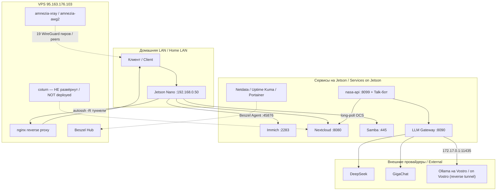

# Архитектура / Architecture

**Дата / Date:** 2026-08-30. Восстановлено по реальному коду и живому состоянию, не по намерениям документации / Reconstructed from actual code and live state, not from documentation intent.

## 1. Таблица компонентов / Component table

| Component | Type | Runtime | Port | Storage | Criticality | Status (30.08) |
|---|---|---|---|---|---|---|
| Immich server+microservices | фотосервис | Node.js (образ) | 2283 | Postgres+pgvecto-rs, `/mnt/storage` | высокая | up 12д, healthy |
| Immich DB | БД | PostgreSQL 16.8 | 5432 internal | volume | высокая | up 12д, healthy, 55 таблиц |
| Immich Redis | кэш/очередь | redis:7-alpine | 6379 internal | in-memory | средняя | up 12д, auth on |
| Nextcloud | файлооблако+Talk | PHP/Apache | 8080 | Postgres, `/mnt/storage`, `/mnt/hdd2tb` | высокая | up 12д, healthy |
| Nextcloud DB | БД | PostgreSQL 16.14 | 5432 internal | volume | высокая | up 12д, healthy, 162 таблицы |
| Nextcloud Redis | кэш/сессии | redis:7-alpine | 6379 internal | in-memory | средняя | up 12д, auth on |
| Samba | файлообмен LAN | crazymax/samba | 445 | `/mnt/storage`, `/mnt/hdd2tb` | средняя | up 12д, healthy |
| LLM Gateway | API-шлюз к LLM | Python/FastAPI/uvicorn | 8090 | нет БД | средняя | up 6д, healthy |
| nasa-api | внутр. API + Talk-бот | Python/FastAPI | 8099 | JWT via Nextcloud OCS | средняя | up 5д, healthy |
| Netdata | мониторинг real-time | образ netdata | 19999 | нет | низкая | up 7д, healthy |
| Uptime Kuma | uptime-мониторинг | Node.js | 3001 | sqlite | средняя | up 7д, healthy, 5 http-мониторов |
| Portainer | Docker UI | — | 9000/9443 | volume | низкая | up 12д, **без healthcheck** |
| Beszel Agent | метрики хоста | systemd (не контейнер) | 45876 | нет | средняя | active |
| Beszel Hub | сборщик метрик | контейнер на **VPS** | 8091 (туннель) | volume (VPS) | средняя | up 7нед (VPS) |
| coturn | TURN/STUN | план на VPS | 3478/5349/49152+ | конфиг | не критично | **НЕ РАЗВЁРНУТ** |
| nginx (reverse proxy) | прокси туннелей | контейнер на **VPS** | 8080/8090/8099/2283/8091 и др. | конфиги | высокая | up 7нед (VPS) |
| AmneziaVPN (xray+awg2) | VPN-сервер | контейнеры на **VPS** | 443/40568 | конфиги | максимальная (правило №2/13) | up 3нед/7нед, 19 пиров |

## 2. Логическая схема данных / Data flow (текстом / as text)

```
Клиент (LAN или VPN 172.29.172.1)
  → Immich/Nextcloud/Samba напрямую на Jetson (192.168.0.50)
  → либо через VPS nginx (проксирует localhost VPS, куда смотрят autossh -R туннели с Jetson:
       -R 12283→2283 Immich, -R 18090→8090 LLM GW, -R 18099→8099 nasa-api)

Talk-бот (nasa-api/talk_bot.py)
  → long-poll Nextcloud OCS API (форма, не JSON — известный дефект-паттерн)
  → LLM Gateway :8090 → редактирование PII → провайдер:
       DeepSeek (по умолчанию) | GigaChat (умеет изображения) | Ollama на Vostro
       (обратный туннель 172.17.0.1:11435, "локальный" — не тратит платную квоту)

Immich/Nextcloud → собственные Postgres+Redis, без внешних зависимостей

Мониторинг: Netdata/Uptime Kuma/Portainer читают Docker socket + HTTP локально
  Beszel Agent → Beszel Hub на VPS (отдельный туннель, порт 45876)
```

## 3. Mermaid-схема / Mermaid diagram



## 4. Расхождение с намерением / Divergence from intent

🇷🇺 Схема выше отражает **реально работающую** систему (устройство `~/nasa`, контейнеры `homecloud_*`). Windows-репозиторий уже содержит переименованный слой (`nas_jetson_nano-*`) — архитектурно идентичный, но с другими именами/путями; физический переезд устройства не выполнен (см. `docs/plans/tranquil-wandering-truffle.md`, часть B).

🇬🇧 The diagram above reflects the **actually running** system (device `~/nasa`, `homecloud_*` containers). The Windows repository already contains a renamed layer (`nas_jetson_nano-*`) — architecturally identical but with different names/paths; the physical device migration has not been executed (see `docs/plans/tranquil-wandering-truffle.md`, Part B).
