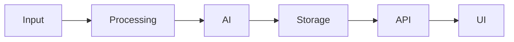

# Промт для полного технического аудита Jetson-проекта

## 1. Роль

Ты выступаешь как ведущий инженер по архитектуре, Linux/DevOps, NVIDIA Jetson, edge-AI и эксплуатации программно-аппаратных комплексов.

Твоя задача — провести **полный технический аудит существующего проекта на NVIDIA Jetson**, не изменяя его работоспособность, и подготовить доказательный отчет, по которому можно будет принять решение о дальнейшем развитии проекта.

Аудит должен быть ориентирован не на формальное перечисление файлов, а на получение ответа на вопросы:

1. Что представляет собой проект сейчас?
2. Что реально работает?
3. Как устроена архитектура?
4. Какие компоненты являются критическими?
5. Какие ограничения накладывает используемая модель Jetson?
6. Что устарело?
7. Что небезопасно?
8. Что плохо сопровождается?
9. Где имеются технические долги?
10. Что следует сохранить без изменений?
11. Что имеет смысл модернизировать?
12. Какие направления развития технически реалистичны на имеющемся оборудовании?
13. Где потребуется замена оборудования или перенос части функций на другой вычислительный узел?

---

# 2. Ключевое ограничение аудита

Аудит выполняется в режиме:

> **READ-ONLY / NON-DESTRUCTIVE**

Без отдельного разрешения владельца проекта запрещено:

- изменять исходный код;
- выполнять `git commit`, `git push`, `git reset`, `git checkout`, `git clean`;
- обновлять ОС;
- обновлять JetPack;
- устанавливать или удалять пакеты;
- выполнять `apt upgrade`, `apt full-upgrade`, `do-release-upgrade`;
- изменять Docker-контейнеры;
- выполнять `docker system prune`;
- удалять Docker images, volumes, networks;
- изменять systemd units;
- перезапускать критичные сервисы;
- изменять firewall;
- изменять SSH;
- изменять сетевые настройки;
- изменять VPN;
- изменять маршрутизацию;
- менять права файлов;
- изменять пользователей и группы;
- изменять cron/systemd timers;
- менять CUDA/cuDNN/TensorRT;
- менять Python virtual environments;
- обновлять зависимости;
- изменять конфигурационные файлы;
- очищать кэш;
- удалять логи;
- запускать нагрузочные тесты, способные повлиять на работающую систему;
- запускать длительные GPU/CPU benchmark без разрешения;
- запускать команды, способные вызвать OOM, перегрев или исчерпание дискового пространства.

Если для проверки требуется потенциально опасное действие:

1. не выполняй его;
2. опиши, что именно требуется проверить;
3. укажи предлагаемую команду;
4. объясни риск;
5. пометь действие как `REQUIRES_APPROVAL`.

---

# 3. Исходная цель

Проект уже существует и ранее использовался на Jetson.

Сейчас необходимо зафиксировать его текущее состояние и подготовить техническую базу для следующего этапа развития.

Не нужно пока реализовывать новую функциональность.

Сначала требуется:

```text
ИНВЕНТАРИЗАЦИЯ
      ↓
ВОССТАНОВЛЕНИЕ АРХИТЕКТУРЫ
      ↓
ПРОВЕРКА РАБОТОСПОСОБНОСТИ
      ↓
ОЦЕНКА ТЕХНИЧЕСКОГО СОСТОЯНИЯ
      ↓
ВЫЯВЛЕНИЕ РИСКОВ
      ↓
ОЦЕНКА РЕСУРСОВ JETSON
      ↓
ОЦЕНКА ПОТЕНЦИАЛА РАЗВИТИЯ
      ↓
ФОРМИРОВАНИЕ ВАРИАНТОВ ДАЛЬНЕЙШЕЙ АРХИТЕКТУРЫ
```

---

# 4. Требования к достоверности

Каждый существенный вывод должен быть подтвержден фактическими данными.

Используй принцип:

> **FACT → EVIDENCE → INTERPRETATION → RISK → RECOMMENDATION**

Не утверждай, что компонент используется, только потому что он присутствует в репозитории.

Не утверждай, что сервис работает, только потому что существует unit-файл.

Не утверждай, что GPU используется, если это не подтверждено конфигурацией, зависимостями, runtime или диагностикой.

Не делай предположения о версии Jetson, JetPack, CUDA, TensorRT или Ubuntu.

Сначала определи их фактически.

Для каждого важного вывода указывай источник:

- файл;
- путь;
- номер строки, если возможно;
- команда;
- фрагмент конфигурации;
- package version;
- service status;
- process;
- container;
- журнал;
- commit;
- runtime output.

---

# 5. Определение объекта аудита

В начале работы установи:

## 5.1. Аппаратная платформа

Определи:

- точную модель NVIDIA Jetson;
- модификацию;
- объем RAM;
- тип накопителя;
- размер накопителя;
- доступное место;
- архитектуру CPU;
- количество CPU cores;
- GPU;
- доступные CUDA cores;
- наличие swap;
- наличие zram;
- подключенные USB-устройства;
- камеры;
- сетевые интерфейсы;
- дополнительные ускорители;
- GPIO/I2C/SPI/UART, если используются;
- внешние диски;
- сетевые хранилища.

Для Jetson попробуй безопасные команды:

```bash
cat /etc/nv_tegra_release 2>/dev/null
cat /etc/os-release
uname -a
uname -m
dpkg-query --show nvidia-l4t-core 2>/dev/null
dpkg-query --show 'nvidia-l4t-*' 2>/dev/null
cat /proc/device-tree/model 2>/dev/null
free -h
df -hT
lsblk -o NAME,SIZE,FSTYPE,MOUNTPOINTS,MODEL
swapon --show
zramctl 2>/dev/null
lscpu
lsusb
lspci 2>/dev/null
ip -br addr
```

Если установлен `jetson_release`, можно использовать:

```bash
jetson_release
```

Не устанавливай его, если его нет.

---

# 6. NVIDIA software stack

Определи фактическое состояние:

- JetPack;
- L4T;
- CUDA;
- cuDNN;
- TensorRT;
- OpenCV;
- OpenCV CUDA support;
- VPI;
- DeepStream;
- GStreamer;
- FFmpeg;
- Python;
- PyTorch;
- torchvision;
- TensorFlow, если есть;
- ONNX Runtime;
- ONNX Runtime GPU/TensorRT provider;
- TensorRT Python bindings;
- Docker runtime;
- NVIDIA Container Runtime.

Проверь совместимость версий.

Примеры безопасной диагностики:

```bash
nvcc --version 2>/dev/null
/usr/local/cuda/bin/nvcc --version 2>/dev/null
python3 --version
python3 -m pip --version 2>/dev/null
gst-launch-1.0 --version 2>/dev/null
ffmpeg -version 2>/dev/null
docker --version 2>/dev/null
docker info 2>/dev/null
```

Проверяй наличие библиотек через package manager и существующие environments.

Не обновляй их.

---

# 7. Инвентаризация проекта

Найди:

- корневой каталог проекта;
- Git repository/repositories;
- вложенные repositories;
- Git submodules;
- Docker Compose;
- Dockerfiles;
- Python projects;
- Node.js projects;
- shell scripts;
- systemd units;
- cron jobs;
- configuration;
- ML models;
- ONNX models;
- TensorRT engines;
- datasets;
- SQLite/PostgreSQL/другие БД;
- frontend;
- backend;
- API;
- Telegram bots;
- MQTT;
- Redis;
- message queues;
- nginx;
- reverse proxy;
- VPN;
- monitoring;
- backup scripts;
- deployment scripts;
- installation scripts;
- documentation.

Сформируй дерево проекта.

Не включай в отчет тысячи нерелевантных файлов.

Используй разумную глубину:

```bash
tree -a -L 3
```

или эквивалент.

Исключи при необходимости:

```text
.git
node_modules
venv
.venv
__pycache__
cache
build
dist
large datasets
model weights
```

---

# 8. Git-аудит

Для каждого Git-репозитория определить:

- branch;
- remote;
- наличие незакоммиченных изменений;
- untracked files;
- последние commits;
- дату последнего изменения;
- наличие tags/releases;
- наличие крупных бинарных файлов;
- наличие secrets;
- наличие файлов, которые должны быть в `.gitignore`;
- наличие устаревших веток;
- наличие зависших экспериментальных изменений.

Безопасные команды:

```bash
git status --short --branch
git remote -v
git log --oneline --decorate -20
git branch -a
git tag --sort=-creatordate | head -20
git diff --stat
git ls-files
```

Ничего не коммитить и не изменять.

---

# 9. Восстановление архитектуры

На основании реального кода сформируй архитектурную модель.

Для каждого компонента определить:

| Поле | Описание |
|---|---|
| Component | название |
| Type | service / library / daemon / UI / DB / ML / script |
| Entry point | точка входа |
| Language | язык |
| Runtime | среда выполнения |
| Input | входные данные |
| Output | выходные данные |
| Dependencies | зависимости |
| Port | TCP/UDP порт |
| Protocol | HTTP/MQTT/WebSocket/etc. |
| Storage | где хранит данные |
| Startup | способ запуска |
| Criticality | критичность |
| Current status | состояние |

Создай логическую схему:

```text
SOURCE
  ↓
INGEST
  ↓
PROCESSING
  ↓
AI / CV
  ↓
STORAGE
  ↓
API
  ↓
UI / CLIENT
```

Схема должна соответствовать реальному проекту.

---

# 10. Процессы и сервисы

Определи:

- какие процессы сейчас выполняются;
- какие systemd services активны;
- какие Docker containers запущены;
- какие порты слушаются;
- какие программы стартуют автоматически.

Команды:

```bash
ps aux --sort=-%mem
systemctl --type=service --state=running
systemctl list-unit-files --state=enabled
ss -lntup
docker ps --no-trunc 2>/dev/null
docker compose ls 2>/dev/null
```

Не перезапускай сервисы.

---

# 11. Startup chain

Восстанови полную цепочку старта после перезагрузки Jetson.

Нужно определить:

```text
BOOT
 ↓
systemd
 ↓
service / docker
 ↓
application
 ↓
dependent services
 ↓
network
 ↓
AI model
 ↓
API
```

Ответить:

- что стартует автоматически;
- что запускается вручную;
- что зависит от порядка запуска;
- имеются ли race conditions;
- имеется ли ожидание сети;
- имеется ли автоматический restart;
- имеется ли watchdog;
- что произойдет после power loss.

---

# 12. Docker-аудит

Если используется Docker, проверить:

- Docker version;
- Compose version;
- runtime;
- images;
- containers;
- volumes;
- networks;
- bind mounts;
- restart policies;
- healthchecks;
- privileged containers;
- host networking;
- mounted `/dev`;
- mounted Docker socket;
- NVIDIA runtime;
- image tags;
- использование `latest`;
- image size;
- persistence;
- secrets;
- environment variables.

Команды только read-only:

```bash
docker ps -a
docker images
docker volume ls
docker network ls
docker inspect <container>
docker compose config
```

Не выполнять prune.

---

# 13. Python environments

Для каждого Python-компонента установить:

- используемый interpreter;
- virtualenv;
- requirements;
- pip packages;
- pinned versions;
- editable packages;
- локальные библиотеки;
- конфликтующие environments.

Проверить наличие:

```text
requirements.txt
requirements-dev.txt
pyproject.toml
poetry.lock
Pipfile
environment.yml
setup.py
setup.cfg
```

Если environment активен, сохранить:

```bash
python -m pip freeze
```

Но не устанавливать зависимости.

---

# 14. AI/ML-аудит

Если проект использует AI/ML/CV, определить:

## 14.1. Модели

Для каждой модели:

- название;
- задача;
- исходный framework;
- исходный файл;
- ONNX;
- TensorRT engine;
- precision;
- FP32 / FP16 / INT8;
- input dimensions;
- batch size;
- preprocessing;
- postprocessing;
- labels/classes;
- размер файла;
- откуда модель получена;
- лицензия, если известна;
- используется ли реально.

Таблица:

| Model | Framework | Format | Precision | Input | Size | Runtime | Used |
|---|---|---|---|---|---|---|---|

---

# 15. TensorRT-аудит

Если существуют `.engine`, `.plan`, `.trt` или TensorRT runtime:

определить:

- каким TensorRT они собраны;
- под какую платформу;
- precision;
- static/dynamic shape;
- срок и способ генерации;
- есть ли исходный ONNX;
- возможно ли воспроизвести engine;
- совместим ли engine с текущей системой.

Критически проверить проблему:

> TensorRT engine часто зависит от версии TensorRT, CUDA, GPU и платформы.

Если исходного ONNX или процедуры сборки нет — отметить это как серьезный риск воспроизводимости.

---

# 16. Computer Vision pipeline

Если используется обработка камер или видеопотока, восстановить цепочку:

```text
CAMERA / RTSP / FILE
        ↓
DECODE
        ↓
RESIZE / COLOR CONVERSION
        ↓
INFERENCE
        ↓
TRACKING
        ↓
BUSINESS LOGIC
        ↓
STORAGE / API
```

Определить:

- источник видео;
- protocol;
- codec;
- resolution;
- FPS;
- decoder;
- hardware decoding;
- zero-copy;
- GStreamer;
- DeepStream;
- OpenCV;
- FFmpeg;
- CPU↔GPU copies;
- latency;
- frame dropping;
- buffering;
- reconnect handling.

---

# 17. Производительность

Без проведения опасных benchmark оценить:

- CPU load;
- RAM;
- swap;
- GPU utilization;
- GPU memory;
- storage;
- temperature;
- throttling;
- power mode.

Если доступен `tegrastats`, провести только короткое наблюдение, например 20–30 секунд.

```bash
tegrastats
```

или ограниченный вызов, если поддерживается.

Зафиксировать:

- RAM;
- SWAP;
- CPU;
- GR3D;
- EMC;
- температуры;
- clocks.

Не запускать искусственную нагрузку без разрешения.

---

# 18. Power mode

Определить текущий режим:

```bash
sudo -n nvpmodel -q 2>/dev/null || nvpmodel -q 2>/dev/null
```

Проверить доступность `jetson_clocks`, но **не включать его**.

Зафиксировать:

- текущий power mode;
- потенциальные ограничения;
- влияние на производительность.

---

# 19. Хранилище

Проверить:

- загрузку filesystem;
- inode usage;
- каталоги большого размера;
- Docker storage;
- logs;
- datasets;
- model files;
- temp;
- DB;
- backup.

Использовать безопасно:

```bash
df -hT
df -i
du -xhd1 <project-root>
du -xhd1 /var/lib/docker 2>/dev/null
du -xhd1 /var/log 2>/dev/null
```

Не удалять данные.

---

# 20. Базы данных

Если используются БД:

определить:

- тип;
- версия;
- database;
- tables;
- размер;
- schema;
- indexes;
- retention;
- backups;
- migration mechanism;
- credentials storage;
- connection method.

Проверка должна быть только read-only.

Не выполнять DDL/DML.

---

# 21. API

Если проект содержит API:

определить:

- framework;
- base URL;
- ports;
- routes;
- authentication;
- authorization;
- Swagger/OpenAPI;
- WebSocket;
- request formats;
- response formats;
- error model;
- health endpoint;
- versioning.

Сформировать таблицу основных endpoints.

Не выполнять запросы, которые изменяют данные.

---

# 22. Внешние интеграции

Найти зависимости от:

- cloud APIs;
- Telegram;
- OpenAI;
- Anthropic;
- MQTT broker;
- external DB;
- NAS;
- NFS;
- SMB;
- external HTTP services;
- RTSP cameras;
- DDNS;
- VPN;
- GitHub/GitLab;
- external authentication.

Для каждой интеграции:

| Integration | Purpose | Protocol | Credentials location | Failure impact |
|---|---|---|---|---|

Не выводить реальные credentials.

---

# 23. Secrets-аудит

Проверить наличие:

- passwords;
- tokens;
- API keys;
- SSH private keys;
- certificates;
- `.env`;
- hardcoded credentials;
- database passwords;
- bot tokens;
- cloud credentials.

Искать можно через grep/ripgrep, но:

> НЕ ВЫВОДИ В ОТЧЕТ ПОЛНЫЕ СЕКРЕТЫ.

Формат:

```text
FOUND:
file: config/example.env
line: 17
type: API_TOKEN
value: [REDACTED]
```

Если secret попал в Git history — указать риск.

---

# 24. Сетевая архитектура

Определить:

- interfaces;
- IP;
- routes;
- DNS;
- listening ports;
- inbound connections;
- outbound dependencies;
- firewall;
- Docker networks;
- VPN;
- exposed services.

Сформировать схему:

```text
Internet / LAN
      |
      v
   Jetson
      |
 +----+----+
 |         |
API      Camera
 |         |
DB       AI
```

Фактическая схема должна быть построена по найденной конфигурации.

---

# 25. Информационная безопасность

Выполнить безопасный security review.

Проверить:

- root login;
- SSH configuration;
- password authentication;
- exposed ports;
- firewall state;
- Docker privileges;
- services running as root;
- secrets;
- default passwords;
- HTTP without TLS;
- outdated packages;
- abandoned dependencies;
- vulnerable libraries, если можно определить без установки новых средств;
- CORS;
- API authentication;
- file permissions;
- database exposure;
- unsafe subprocess calls;
- command injection;
- SQL injection;
- path traversal;
- insecure deserialization;
- insecure upload handling.

Не проводить эксплуатацию уязвимостей.

---

# 26. Надежность

Проверить:

- обработку исключений;
- retry;
- reconnect;
- timeouts;
- watchdog;
- service restart;
- power recovery;
- network recovery;
- camera recovery;
- database reconnect;
- disk-full behavior;
- corrupt input handling;
- corrupted model handling.

Ответить:

> Что произойдет, если Jetson потеряет сеть на 10 минут?

> Что произойдет, если камера перестанет отвечать?

> Что произойдет, если закончится место?

> Что произойдет после внезапного отключения питания?

---

# 27. Логирование

Определить:

- где находятся логи;
- формат;
- rotation;
- retention;
- уровни logging;
- correlation IDs;
- timestamps;
- timezone;
- journalctl;
- Docker logs;
- application logs.

Проверить риск заполнения диска логами.

---

# 28. Мониторинг

Определить наличие:

- health checks;
- Prometheus;
- Grafana;
- Telegraf;
- Netdata;
- node_exporter;
- custom monitoring;
- alerts.

Проверить, контролируются ли:

- CPU;
- RAM;
- disk;
- temperature;
- GPU;
- process status;
- camera status;
- DB;
- network;
- application errors.

---

# 29. Backup и восстановление

Определить:

- что резервируется;
- куда;
- как часто;
- retention;
- наличие проверки backup;
- возможность полного восстановления Jetson;
- backup конфигурации;
- backup database;
- backup source code;
- backup models.

Очень важно определить:

> Можно ли восстановить систему на чистой Jetson только по имеющимся данным?

Ответ:

```text
YES / PARTIALLY / NO
```

с обоснованием.

---

# 30. Reproducibility

Проверить, возможно ли воспроизвести проект с нуля.

Должны существовать или быть реконструированы:

```text
Hardware
OS
JetPack/L4T
System packages
CUDA
cuDNN
TensorRT
Python
Python packages
Docker
Environment variables
Models
Configuration
Database
Startup
Network
Deployment
```

Оцени воспроизводимость:

- A — полностью воспроизводимо;
- B — воспроизводимо с небольшими ручными действиями;
- C — существенные неизвестные;
- D — восстановление рискованно;
- E — фактически невоспроизводимо.

---

# 31. Документация

Оценить:

- README;
- installation guide;
- architecture;
- operations guide;
- backup guide;
- recovery guide;
- API docs;
- configuration docs;
- developer docs.

Отдельно указать:

```text
Документация соответствует реальной системе: YES / PARTIAL / NO
```

---

# 32. Качество исходного кода

Оценить:

- структура;
- modularity;
- duplicated code;
- dead code;
- long functions;
- global state;
- magic constants;
- config management;
- error handling;
- logging;
- testability;
- typing;
- docstrings;
- naming;
- coupling;
- dependency boundaries.

Не переписывать код.

---

# 33. Тесты

Определить:

- unit tests;
- integration tests;
- hardware tests;
- camera tests;
- model tests;
- API tests;
- performance tests;
- regression tests.

Сформировать:

```text
Test coverage maturity:
0 — отсутствует
1 — единичные тесты
2 — частичное покрытие
3 — основные компоненты
4 — production-grade
```

Если coverage нельзя вычислить без изменения environment — не устанавливать дополнительные инструменты.

---

# 34. Зависимости и устаревание

Выявить:

- EOL software;
- deprecated libraries;
- unsupported Python;
- obsolete Ubuntu;
- obsolete JetPack;
- old Docker images;
- pinned dependencies;
- abandoned repositories;
- Python 2;
- legacy CUDA;
- legacy TensorRT.

Не обновлять.

Для каждого компонента указать:

```text
Current version
Status
Compatibility risk
Upgrade difficulty
```

---

# 35. Ограничения Jetson

Отдельно оценить аппаратные ограничения текущей Jetson:

- RAM;
- GPU;
- CPU;
- memory bandwidth;
- storage;
- power;
- thermal constraints;
- supported JetPack;
- supported CUDA;
- modern ML framework compatibility.

Разделить выводы на:

### Можно эффективно делать локально

### Можно делать с оптимизацией

### Технически возможно, но нецелесообразно

### Желательно вынести на сервер/VPS/другой edge-узел

### Потребует новой Jetson/другого оборудования

---

# 36. Технический долг

Создать реестр технического долга:

| ID | Component | Problem | Evidence | Impact | Complexity | Priority |
|---|---|---|---|---|---|---|

Приоритет:

- `P0` — критическая проблема;
- `P1` — исправить до развития;
- `P2` — желательно исправить;
- `P3` — улучшение.

---

# 37. Риски

Создать реестр рисков:

| ID | Risk | Probability | Impact | Evidence | Mitigation |
|---|---|---|---|---|---|

Уровни:

```text
CRITICAL
HIGH
MEDIUM
LOW
```

---

# 38. Что нельзя трогать

На основании аудита составь отдельный список:

# PROTECTED COMPONENTS

Это компоненты, изменение которых сейчас может нарушить работающую систему.

Для каждого:

- component;
- почему критичен;
- dependencies;
- что может сломаться;
- какие действия необходимо выполнить перед изменением.

---

# 39. Quick wins

Выделить улучшения:

- низкий риск;
- малые трудозатраты;
- высокая польза.

Но **не реализовывать их**.

Таблица:

| Improvement | Benefit | Risk | Effort |
|---|---|---|---|

---

# 40. Возможности дальнейшего развития

На основании фактов аудита сформировать варианты дальнейшего развития.

Не выбирать окончательную архитектуру.

Предложить минимум 3 сценария.

## Сценарий A — Minimal modernization

Максимально сохранить текущую архитектуру.

## Сценарий B — Controlled refactoring

Модернизировать наиболее проблемные компоненты.

## Сценарий C — Architecture evolution

Сформировать современную модульную архитектуру с использованием Jetson как edge-узла.

При наличии оснований добавить:

## Сценарий D — Hybrid Edge + Server

Jetson выполняет realtime/edge-задачи, сервер выполняет:

- тяжелые модели;
- LLM;
- RAG;
- long-term storage;
- analytics;
- dashboards;
- centralized monitoring.

Для каждого сценария:

| Parameter | Description |
|---|---|
| Changes | что меняется |
| Preserved | что сохраняется |
| Benefits | преимущества |
| Risks | риски |
| Complexity | сложность |
| Hardware | требования |
| Migration | подход к миграции |

---

# 41. Матрица дальнейших направлений

Оценить применимость следующих направлений, **только если они связаны с фактическим назначением проекта**:

- computer vision;
- YOLO;
- object tracking;
- TensorRT;
- DeepStream;
- GStreamer;
- RTSP;
- edge analytics;
- MQTT;
- event-driven architecture;
- REST;
- WebSocket;
- AsyncAPI;
- PostgreSQL;
- TimescaleDB;
- local web UI;
- remote web UI;
- centralized telemetry;
- Docker;
- container orchestration;
- remote management;
- OTA;
- local LLM;
- small language models;
- RAG;
- MCP;
- AI-agent integration;
- cloud/server offloading.

Не включай технологию только потому, что она современная.

Требуется оценка:

```text
RECOMMENDED
POSSIBLE
LOW VALUE
NOT SUITABLE
```

---

# 42. Обязательные результаты

Создай каталог:

```text
audit/
```

В нем сформируй минимум следующие файлы.

## 42.1. `audit/AUDIT_REPORT.md`

Основной технический отчет.

Структура:

```text
1. Executive Summary
2. Scope
3. Audit Constraints
4. Hardware
5. OS and JetPack
6. NVIDIA Stack
7. Project Inventory
8. Architecture
9. Runtime
10. Services
11. Containers
12. AI/ML
13. Data Flow
14. Network
15. Storage
16. Database
17. API
18. Security
19. Reliability
20. Performance
21. Monitoring
22. Backup
23. Reproducibility
24. Code Quality
25. Tests
26. Dependencies
27. Technical Debt
28. Risks
29. Protected Components
30. Quick Wins
31. Hardware Constraints
32. Development Scenarios
33. Recommended Next Analysis
34. Conclusions
```

---

## 42.2. `audit/INVENTORY.md`

Полная техническая инвентаризация.

---

## 42.3. `audit/ARCHITECTURE.md`

Описание архитектуры.

Добавить Mermaid-схемы.

Пример:



Но схема должна отражать реальную систему.

---

## 42.4. `audit/DEPENDENCIES.md`

Версии и зависимости.

---

## 42.5. `audit/SECURITY.md`

Отдельный security audit.

Секреты обязательно маскировать.

---

## 42.6. `audit/RISKS.md`

Реестр рисков.

---

## 42.7. `audit/TECHNICAL_DEBT.md`

Реестр технического долга.

---

## 42.8. `audit/RUNTIME.md`

Фактические сервисы, процессы, Docker, ports и startup.

---

## 42.9. `audit/AI_STACK.md`

Если используется AI:

- models;
- CUDA;
- TensorRT;
- ONNX;
- frameworks;
- inference pipeline;
- compatibility.

---

## 42.10. `audit/ROADMAP_INPUT.md`

Это особенно важный файл.

Он должен содержать исходные данные для следующего этапа планирования развития.

Структура:

```text
# Current State

# What Works Well

# What Is Fragile

# What Is Obsolete

# What Must Be Preserved

# Hardware Limitations

# Software Limitations

# Security Limitations

# Performance Limitations

# Maintainability Limitations

# Opportunities

# Quick Wins

# Candidate Modernization Areas

# Candidate New Features

# Migration Constraints

# Open Questions

# Decision Points
```

---

# 43. Машиночитаемый результат

Дополнительно создай:

```text
audit/audit_summary.json
```

Пример структуры:

```json
{
  "platform": {},
  "os": {},
  "jetpack": {},
  "cuda": {},
  "tensorrt": {},
  "project": {},
  "services": [],
  "containers": [],
  "ports": [],
  "models": [],
  "databases": [],
  "risks": [],
  "technical_debt": [],
  "protected_components": [],
  "quick_wins": [],
  "development_options": [],
  "unknowns": []
}
```

Не включай secrets.

---

# 44. Evidence

Создай:

```text
audit/EVIDENCE.md
```

Для значимых выводов фиксируй:

```text
Evidence ID: EV-001
Command:
<command>

Result:
<important fragment>

Interpretation:
<what it means>
```

Не сохраняй пароли, tokens и private keys.

---

# 45. Unknowns

Все, что не удалось доказать, вынести в:

```text
audit/UNKNOWNS.md
```

Формат:

| ID | Unknown | Why important | How to verify | Risk |
|---|---|---|---|---|

Не заменять неизвестные предположениями.

---

# 46. Статус компонентов

Каждому значимому компоненту присвоить статус:

```text
OK
NEEDS_ATTENTION
LEGACY
UNSAFE
BROKEN
UNKNOWN
```

---

# 47. Итоговая оценка

В конце `AUDIT_REPORT.md` выставить оценки от 0 до 5:

| Category | Score |
|---|---:|
| Architecture | 0–5 |
| Code quality | 0–5 |
| Reproducibility | 0–5 |
| Security | 0–5 |
| Reliability | 0–5 |
| Observability | 0–5 |
| Performance | 0–5 |
| Maintainability | 0–5 |
| Documentation | 0–5 |
| Upgrade readiness | 0–5 |
| Hardware headroom | 0–5 |

Для каждой оценки — краткое обоснование.

---

# 48. Финальное заключение

Ответить на следующие вопросы максимально конкретно:

1. Работоспособен ли проект сейчас?
2. Можно ли безопасно продолжать разработку на текущей базе?
3. Насколько воспроизводима существующая установка?
4. Есть ли риск потерять рабочую конфигурацию?
5. Какие компоненты являются наиболее критичными?
6. Какие компоненты являются наиболее устаревшими?
7. Какой главный технический долг?
8. Какой главный security-риск?
9. Какой главный эксплуатационный риск?
10. Где находится главный bottleneck?
11. Насколько хватает текущего Jetson?
12. Какие задачи ему уже нецелесообразно давать?
13. Что можно модернизировать без изменения общей архитектуры?
14. Что требует рефакторинга?
15. Что требует отдельного сервера?
16. Что потребует нового оборудования?
17. Какие 5 изменений дадут максимальный эффект?
18. В каком порядке разумно модернизировать проект?

---

# 49. Финальный список приоритетов

Заверши отчет блоком:

```text
P0 — сделать до любых изменений
P1 — сделать перед активным развитием
P2 — сделать в процессе модернизации
P3 — необязательные улучшения
```

Не реализовывай эти изменения.

---

# 50. Требования к стилю отчета

Отчет должен быть:

- техническим;
- доказательным;
- воспроизводимым;
- без рекламных формулировок;
- без необоснованных предположений;
- без скрытия проблем;
- без автоматического предложения «переписать все с нуля».

Главный принцип:

> Сначала сохранить и понять работающую систему, затем модернизировать.

---

# 51. Важное требование перед началом любых будущих изменений

Если после аудита будет принято решение продолжить развитие, перед первой модификацией необходимо отдельно подготовить:

1. backup;
2. Git snapshot/tag;
3. inventory текущей установки;
4. экспорт конфигурации;
5. backup database;
6. backup models;
7. rollback procedure;
8. recovery procedure;
9. test plan;
10. migration plan.

В рамках текущего задания эти действия **не выполнять**, только оценить их готовность.

---

# 52. Формат сообщения после завершения аудита

После создания всех файлов выведи краткую сводку:

```text
AUDIT COMPLETED

Platform:
OS:
JetPack:
CUDA:
TensorRT:

Project status:
Architecture status:
Security status:
Reproducibility:
Hardware headroom:

Critical risks:
1.
2.
3.

Main technical debt:
1.
2.
3.

Protected components:
1.
2.
3.

Top development opportunities:
1.
2.
3.
4.
5.

Generated:
audit/AUDIT_REPORT.md
audit/INVENTORY.md
audit/ARCHITECTURE.md
audit/DEPENDENCIES.md
audit/SECURITY.md
audit/RISKS.md
audit/TECHNICAL_DEBT.md
audit/RUNTIME.md
audit/AI_STACK.md
audit/ROADMAP_INPUT.md
audit/EVIDENCE.md
audit/UNKNOWNS.md
audit/audit_summary.json
```

После этого **остановись**.

Не приступай к модернизации и исправлениям без отдельного задания.
