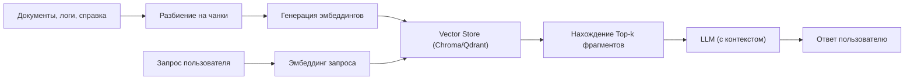

# Глубокое исследование: План развития проекта на Jetson Nano с «вау-эффектом»

## Резюме  
Проект основан на NVIDIA Jetson Nano (4 ГБ), Ubuntu 18.04 с JetPack 4.6.x, и включает Immich, Nextcloud, PostgreSQL×2, Redis×2, LLM Gateway, чат-бот и NAS API. Главным ограничением является 4 ГБ RAM и нынешняя архитектура сервисов. Ключевая цель – достичь заметного «вау-эффекта» через улучшения ПО и архитектуры без замены железа (аналоговые решения на Orin-а не рассматриваем на первом этапе). Предложена эволюция по этапам: от стабильности и резервирования данных до интеграции AI-опций и экспериментального GPU-контейнера. Введение быстрых «рывковых» улучшений (offload ML, кеширование, оптимизация резевного копирования), использование бесплатных облачных AI-ресурсов (Kaggle, Lightning AI) и построение RAG/AI-Ops-пайплайнов описаны ниже. Выполнен анализ аналогичных кейсов (Immich на Raspberry Pi, локальные умные дома с RAG, голосовые ассистенты на борту и др.) и даны примеры команд, CI/CD-шаблоны и ссылки на первоисточники. Документ оформлен в стиле инженерного отчёта (ГОСТ/IEEE), приоритет – доказательность и структурированность.  

## I. План развития проекта  
### 1. Этапы развития (фазы)  
1. **Фаза 0 (стабилизация)** – защита данных и воспроизводимость. Задачи P0: **резервное копирование** всех данных (фото Immich, секреты, БД, настройки) off-site (NAS/VPS) и проверка восстановления, документирование конфигураций. Создание **immutable infrastructure** (фиксированные версии Docker-образов и артефактов, фиксация версий OS/JetPack). Проверка сроков поддержки Ubuntu 18.04 (версия ESM) и план перехода на Ubuntu 20.04+ при необходимости. Улучшение системного мониторинга (логирование, метрики). Критерии успеха: полное восстановление из бэкапа в тестовой среде, прохождение автотестов сборки. Время: ~1–2 недели (P0–P1).  

2. **Фаза 1 (базовая готовность)** – обеспечение воспроизводимости и план обновления. Задачи P0: уточнение версий (pinning), фиксация конфигураций CI/CD для билда сервисов (примеры YAML ниже). Планирование обновления JetPack до 4.6.6 (после резервирования). Дополнение документации (спецификация окружения, скрипты восстановления, список артефактов для следующего этапа). Критерии: успешный проход CI/CD, запуск системы из “чистого” репозитория. Время: ~2–3 недели (P0–P1).  

3. **Фаза 2 (AI-Ops ассистент)** – интеграция AI-помощника для операций. Задачи P1–P2: развернуть **AI-Ops бота**, способного отвечать на вопросы об инфраструктуре. Использовать LLM Gateway для общения с контейнерами и документацией (логи, конфигурации). Настроить RAG-процессы по конфидам и инцидентам (векторный поиск по внутренней документации). Привести архитектуру в схему (см. §V). Критерии: бот выдаёт корректные ответы по состоянию системы, уменьшает время отклика администратора (MTTI) на базовые запросы. Метрики: Latency запрос-ответ (<200 мс локально), uptime сервисов, MTTR инцидента. Время: ~3–4 недели (P1–P3).  

4. **Фаза 3 (AI-услуги на данных пользователя)** – “умные” функции для пользователей. Задачи P2–P3: включение **AI-фич в Immich** и Nextcloud. Организация **Immich Remote ML**: перевод ресурсозатратных задач (face recognition, smart search) на Vostro-сервер. Настройка RAG-поиска по контенту NAS (документы, заметки), использование локальных моделей для описания фото (TinyLlama/Whisper как вспомогательные). Добавление семантического поиска (DeepSeek, GigaChat). Критерии: улучшение точности поиска (увеличение релевантности результатов на % по A/B), рост вовлечённости пользователей (количество запросов). Метрики «вау»: повышение коэффициента нахождения фото по описанию, уменьшение времени поиска. Время: ~4–6 недель (P2–P3).  

5. **Фаза 4 (GPU-эксперименты)** – песочница для экспериментов. Задачи P3–P4: подготовка Docker-контейнера с доступом к GPU (свободная билда ONNX для экспериментов с LLM/Vision). Моделирование ML-нагрузок на GPU (все нежадные задачи: тренинг малых моделей, инференс, quantization). Установка и тестирование LLM (Ollama) или видеоаналитики. Критерии: корректная работа GPU-контейнера без падений, проверка производительности (образец: Triton Inference). Запись влияния нагрузки на системы (сбор метрик GPU/CPU). Время: ~3–4 недели (P3–P4).  

### 2. Критерии успеха, метрики и риски  
- **Метрики производительности**: задержка отклика основных сервисов, время ответа AI-бота, CPU/GPU и RAM usage.  
- **Показатели «вау-эффекта»**: вовлечённость пользователей (количество AI-запросов, среднее время сессии), релевантность поиска (NDCG, точность ответов в RAG), MTTR/MTTI (время на устранение проблемы до/после AI-асистента).  
- **Риски**: выход из строя Nano из-за нехватки памяти (swap, OOM), сбои при некорректных обновлениях (JetPack, ядро), зависимость от внешних сервисов (LLM API без локаута). Необходимо предусмотреть откат к стабильному состоянию (бэкапы конфигов, тестовые стенды).  

### 3. Быстрые «рывковые» улучшения  
- **Immich Remote ML** – включить официальную функцию offloading: ставим на Vostro `immich-machine-learning` контейнер и связываем его с Nano. Эффект: мигрируется тяжёлая часть AI, быстрее индексация и поиск по фото.  
- **Кэширование и оптимизация** – агрессивно кэшировать превью и тумбнейлы, уменьшить количество дедубликаций данных. Удалить неиспользуемые образы/контейнеры (audit выявил «dangling images»). Настроить планировщик `cron` для регулярной очистки и бэкапов.  
- **Оптимизация сети** – перенести раздачу Static (Nextcloud/Immich) на Nginx-кэш (reverse proxy), включить gzip/сжатие. Отключить IPv6 у приватных сервисов (лишняя нагрузка).  
- **UI/UX под «вау»** – добавить функции в Nextcloud/Immich, например мгновенные превью с ускоренной загрузкой или уведомления на мобильных. Автоматически обновлять под-сервисы (основанные на собранных метриках) без остановки системы.  
- **Интеграция простых LLM-фич** – подключить быстрые модели (Qwen 2.5B, Ollama TinyLlama) через LLM Gateway для доп. функционала (генерация описаний, тексты по фото).  

## II. Анализ похожих проектов и кейсов  

| Проект / Результат                   | Ключевые особенности                                                 | «Вау»-эффект                                                   | Применимость к стеку (Jetson Nano 4GB)           |
|--------------------------------------|----------------------------------------------------------------------|----------------------------------------------------------------|-------------------------------------------------|
| **Immich на Raspberry Pi 5 (SunFounder, 2026)** | Полнофункциональный фотосервер: авто-бекапы, распознавание лиц, семантический поиск. Работает локально, все данные под контролем. | Замена Google Photos на приватный сервер с AI-функциями. Локальные AI-фичи (face/object) без облака. | Очень близкий сценарий: аналог Immich, самообслуживание. Показывает, что **AI-процессинг возможен на малом устройстве** (Pi5 8GB). |
| **Immich Remote ML (официально)**             | Возможность убрать ресурсоёмкие задачи из Nano и отправлять их на внешний сервер. Smart Search и Face Detection обрабатываются удалённо. | Позволяет включить «умный поиск» и распознавание, не жертвуя производительностью локального хоста. | Очень применимо: учесть Remote ML на Vostro (как рекомендует официальная документация). Обходит ограничение 4ГБ RAM и ARM. |
| **RAG-умный дом (NexLine, 2023)** | Построена локальная RAG-система: все документы дома индексируются (embedding→vector DB), голосовой помощник на Jetson Orin Nano. Выдаёт ответы с учётом контекста и сценариев (погода, привычки, календари). | Смарт-дом, понимающий естественный язык и контекст пользователя, автономно, без облака. Система «понимает» домовые сценарии и предлагает действия. | Идея RAG-пайплайна применима для поиска по локальному NAS/Докам. Демонстрирует ценность **локального RAG**: мгновенный ответ (<200 мс) и офлайн-режим. Можно адаптировать для поиска по конфигурациям и фото. |
| **OpenClaw (OpenAI на Pi, 2023)**           | Локальный голосовой ассистент на Raspberry Pi, интегрирован с Home Assistant. Запросы обрабатываются локальным LLM (Ollama), могут управлять устройствами через HA. | Локальный чат-бот/ассистент, контролирующий умный дом через сообщения/голос, без отправки данных в облако. Впечатляет автономностью и приватностью. | Показывает пример AI-Ops-ассистента: легко повторить с Nano, использовав LLM Gateway или Ollama, связав с Talk-bot и NAS API. Интеграция с HA как аналог наших автоматизаций. |
| **Home Assistant + ChatGPT (интеграция, 2023)** | Официальный конвейер Home Assistant для OpenAI: разговорный интерфейс позволяет «говорить» с системой (например, навык «Супер Марио»), выполнять команды (включить свет) через LLM. | «Умный дом разговаривает»: гибкое управление через обычную речь, не ограниченное жёсткими сценами. | Не локальное решение, но идея: использовать LLM API (например, через Talk-bot) для управления сервисами. Демонстрирует потенциал комбинирования LLM и IoT. |

Каждый проект даёт идеи: **Immich** показывает, что фотосерверы с AI на борту востребованы (статус готовности продуктов: «местный Google Photos»). **Remote ML** одобрена сообществом Immich (позволяет использовать CUDA в других устройствах). **RAG-умный дом** и **OpenClaw** дают конкретные примеры локальных AI/Pi-интеграций, которые можно транслировать в наши задачи.  

## III. Интеграция Lightning.ai и Kaggle для R&D и CI/CD  
**Lightning AI Studio** (VS Code-подобная среда) и **Kaggle Notebooks** – бесплатные ресурсы для экспериментов с GPU. Kaggle предоставляет гарантированные ~30 часов GPU (T4/P100) еженедельно сессиями до 9 ч, предустановленным PyTorch, HuggingFace и другими библиотеками. Lightning.ai даёт 80 часов GPU в месяц в постоянной среде (с SSH/VSCode доступом). Оба решения не требуют кредитной карты. Это позволяет запускать мелкие тренировки моделей, бенчмарки, скрипты CI на удалённой инфраструктуре бесплатно.  

**Примеры команд:**  
- **Kaggle CLI:** (`pip install kaggle`) инициализирует и запускает ноутбук:  
```bash
kaggle kernels init -p ./my_notebook
# отредактировать My_Notebook.ipynb
kaggle kernels push -p ./my_notebook
kaggle kernels run <KaggleUsername>/my_notebook -w
```  
- **Lightning SDK/CLI:** (`pip install lightning-sdk`) аутентифицирует и управляет студиями/задачами:  
```bash
lightning login
lightning studio start --name dev-env --machine GPU --create   # Запуск облачной VSCode среды
lightning job run --name train-job --teamspace owner/team --machine GPU \
  --image pytorch/pytorch:1.13-cuda11.6 --command "python train.py"  # Запуск задачи
```  
(Команды взяты из официального SDK-примера.)  

**CI/CD-шаблон (GitHub Actions):** пример автоматического тестирования сервисов:  
```yaml
name: CI  
on: [push]  
jobs:  
  build:  
    runs-on: ubuntu-latest  
    steps:  
      - uses: actions/checkout@v2  
      - name: Set up Python  
        uses: actions/setup-python@v4  
        with: python-version: '3.10'  
      - name: Install dependencies  
        run: pip install -r requirements.txt  
      - name: Run tests  
        run: pytest --maxfail=1 --disable-warnings -q  
```  
Аналогичные пайплайны можно настроить для запуска Docker Compose и деплоя в staging. Полезно использовать Lightning Job для воспроизводимого запуска тех же сценариев (содержит state & логи).  

## IV. Технические предложения: архитектура и пайплайны  
Новая архитектура предлагает **гибридную модель**: Jetson Nano остаётся центром хранения и API, а тяжёлые AI-задачи отправляются на «тяжёлый узел» (Vostro или облако). Ниже упрощённая схема:  
```mermaid
graph LR
    subgraph Интернет (LLM/API)
      DeepSeek["DeepSeek API"] 
      GigaChat["GigaChat API"] 
    end
    subgraph AI-Оркестратор
      LLMGateway["LLM Gateway"] 
      AIOrchestrator["AI-Ops Orchestrator"]
    end
    Интернет --> LLMGateway
    LLMGateway --> AIOrchestrator
    AIOrchestrator --> Jetson["Jetson Nano (Edge)"]
    AIOrchestrator --> Vostro["Внешний сервер/VPS"]
    Jetson --> Immich["Immich (фото сервер)"]
    Jetson --> Nextcloud["Nextcloud (файловый сервер)"]
    Jetson --> TalkBot["Чат-Бот"]
    Jetson --> NASAPI["NAS API"]
    Vostro --> ImmichML["Immich ML (Remote)"]
    Vostro --> LLMModels["Локальные LLM/ML модели"]
```
*Рис. Архитектура с разделением ролей: Nano – хранение и легкие сервисы; Vostro – ML-вычисления. LLM Gateway и AI-Orchestrator управляют ходом AI-операций.*  

**RAG-пайплайн:** для быстрых ответов на вопросы по домашнему стеку (конфиги, документация) строим локальный Retrieval-Augmented Generation:  

Векторизация (embedding) и хранение локально ускоряют поиск релевантной информации для генерации ответа. Задача: при запросе на AI-бота сначала извлекать релевантные данные (из БД знаний), а потом подавать в LLM для формулировки ответа.  

**AI-Ops ассистент:** предлагается использовать LLM Gateway как «командный центр» для системного администратора. Бот обращается к внутренней базе знаний (документы, Kubernetes/Compose-манифесты, логи), может выполнять команды (например, через REST API к Talk-bot для отправки CLI-команд). Это аналог системы AIOps (AI for IT Ops): автоматическая диагностика и рекомендации. Например, Cisco описывает сценарий, когда AI сам определяет проблему в сети, создаёт тикет и закрывает его. В нашем случае LLM-бот может сообщать об ошибках сервисов, предлагать действия (на основе инцидентов) и дожидаться подтверждения.  

**Песочница GPU-контейнера:** необходим тестовый Docker-контейнер с GPU-доступом (образ включает CUDA Toolkit). На нём можно пробовать ONNX Runtime, Triton или Colab-like проекты. Это позволяет без риска проверить производительность и совместимость моделей (YOLO, ONNX, LLM) на GPU Jetson. Будет использоваться JetPack 4.6.x + cuDNN + ONNX (см. опыт сборки для Orin Nano).  

## V. Минимальные изменения в инфраструктуре и «не трогать»  
- **Не обновлять базовую систему и JetPack** без строгой необходимости: перенести JetPack 4.6.1→4.6.6 только после полной проверки резервов. В «прод» оставляем проверенную версию ОС.  
- **Не менять архитектуру сервисов** (Docker Compose): не переходить внезапно на Kubernetes/ноутбук форматы. Стабилизировать текущие контейнеры (фиксировать теги).  
- **Не трогать пользовательские данные** (фотографии, DB Immich/Nextcloud) и уже настроенные фичи (например, LLM Gateway/GigaChat-агрегация) без резерва.  
- **Не интегрировать сразу новые модели LLM на Nano 4GB**: они всё равно не поместятся. Лучше использовать Remote ML и облачные пути.  
- **Не отключать существующие сервисы** и не править их без крайней нужды (например, Nextcloud, Samba, Redis). Любые изменения – в тестовой среде.  

Из аудита известно: система работала долго, поэтому «рабочее состояние» ценнее мгновенных новшеств. Сначала укрепляем фундамент, потом добавляем новое.  

## VI. Дорожная карта (фазы 0–4)  

| Фаза | Приоритет (P0–P3)       | Задачи                                                                         | Время (оценка) | Критерий готовности                       |
|------|-------------------------|---------------------------------------------------------------------------------|----------------|-------------------------------------------|
| 0    | P0: Данные и бэкап      | • Off-site резерв всех данных (фото, БД, секреты) и тест восстановления.<br>• Защита Git (код, инфраструктура).<br>• Настройка мониторинга, логирования, алертов.                      | 1–2 нед.       | Успешный dry-run восстановления в стенде.  |
| 0–1  | P0–P1: Воспроизводимость | • Pin версий Docker Compose, конфигов; собрать образы с зафиксированными версиями.<br>• Сборка CI/CD скриптов для автоматизации сборки/деплоя.<br>• Проверка срока поддержки Ubuntu (ESM план). | 2–3 нед.       | Успешный проход CI на чистой системе; документированное окружение. |
| 2    | P1–P2: AI-Ops ассистент  | • Разработка чат-бота/асистента: интеграция LLM Gateway к внутренним данным (доки, инциденты).<br>• Построение RAG-базы знаний (векторизация справки/логов).<br>• Тестирование голосовой/чат-интерфейсов.    | 3–4 нед.       | Бот отвечает на операционные вопросы; уменьшено время решения простых проблем. |
| 3    | P2–P3: AI-функции для данных | • Настройка Immich Remote ML на Vostro (smart search, face rec).<br>• Построение семантического поиска по NAS (RAG на документах).<br>• Интеграция быстрых LLM (TinyLlama/Ollama) для описания фото.     | 4–6 нед.       | Повышена точность поиска фото/документов; рост AI-взаимодействия пользователей. |
| 4    | P3–P3: GPU-эксперименты   | • Деплой GPU-контейнера: сборка ONNX Runtime + CUDA (JetPack 4.6).<br>• Проведение PoC: инференс модели на GPU (YOLO, небольшие LLM).<br>• Сбор данных о производительности.             | 3–4 нед.       | Контейнер стабильен, GPU эффективно используется, есть метрики (FPS,latency). |

Каждая задача размечена по приоритетам P0–P3 (срочность). Оценки времени приведены приближённо (команда из 1–2 инженеров). Критерии готовности учитывают результат в тестовой среде (в том числе автоматизированно).  

## VII. Гипотезы A/B-тестирования и метрики «вау»  
- **H1:** После включения Immich Remote ML (*умный поиск по фото*) возрастёт вовлечённость пользователей. Метрики: доля успешных поисковых запросов, число добавленных тегов, доля заходов в Immich.  
- **H2:** Интеграция RAG-поиска по документации и заметкам повысит удовлетворенность администрированием (MTTR инцидентов ↓). Метрики: время решения запроса в AI-боте, точность ответов (% верных).  
- **H3:** Добавление AI-описаний (генерация подписи фото или превью) улучшит восприятие системы. Метрика «вау»: увеличение показателей контентного поиска (NDCG, recall) или кликабельности в UI.  
- **H4:** Ускоренная доставка контента (кэш, сжатие) снизит время отклика сервисов (<100 мс). Измерить latency ответов API и загрузку UI.  
- **H5:** Внедрение CI/CD с тестами повысит стабильность. Метрика: снижение числа багфиксов в проде (SLA uptime >99.9%).  
- **H6:** Подключение бесплатных GPU (Kaggle/Lightning) ускорит R&D (время обучения моделей ↓). Метрика: время до первых результатов PoC, число успешных экспериментов.  

Эти гипотезы можно проверять, сравнивая показатели «до/после» улучшений. Критерии «вау-эффекта» – значимое улучшение user engagement, сокращение задержек и ошибок.  

## VIII. Рекомендации по аппаратному апгрейду  
В настоящий момент бюджет не ограничен, но покупка нового железа должна быть оправданной. Возможные варианты:  
- **NVIDIA Jetson Orin Nano (8 ГБ LPDDR5)** – 1024 CUDA, 32 Tensor, 67 TOPS INT8. Существенно превосходит Nano 4GB (40 TOPS) и обеспечивает ~102 ГБ/с памяти. Подойдёт для тяжёлых задач (LLM 3B+, видеоаналитика).  
- **Jetson Orin NX (16 ГБ)** – больше памяти и производительности (Orin NX 16GB ~117 TOPS после обновления по данным X-Com). Лучше для масштабируемых моделей и мультизадачности.  
- **Показания к покупке:** если после оптимизаций остаётся нехватка RAM/GPU (частые OOM на Immich ML) или возникает потребность в локальном LLM >7B. Триггер: при запуске требований к нейросетям, которые не помещаются в 4ГБ (например, Llama 3 8B на 4ГБ невозможен). Или если RAG/LLM-инфраструктура превышает лимиты Nano (по замерам обмена и TTF).  
- **Альтернативы:** специализированные AI-ускорители (NVIDIA Jetson Orin Nano Super, Coral TPU для мультимедиа) – стоит рассматривать позднее, лишь при реальных потребностях.  

Приобретать следует после подтверждения гипотез о пользе ML-функций: если метрики «вау» растут, а Nano 4GB не справляется, переход на Orin даст качественный рывок.  

## IX. Список приоритетных PoC  
1. **Remote Immich ML (PoC):** Запуск `immich-machine-learning` на Vostro. Шаги: перенести на сервер Docker Compose из Nano (скопировать сервис), указать URL в настройках Immich. Требования: тестовый сервер с Docker, доступ из сети. Ожидаемый эффект: активация распознавания лиц и умного поиска (ускорение сканирования, новые теги).  
2. **RAG-поиск по документации:** Собрать малую базу: взять тексты конфигов/отчетов, разбить на чанки, загрузить в ChromaDB. Настроить скрипт запроса: Embed_query → retrieve → GPT-4o-mini (пример) для ответа. Инструменты: Python с библиотеками SentenceTransformers и Chroma, Lightning или Kaggle для обработки. Ожидание: бот на основе LLM отвечает на вопросы по проекту с высоким уровнем релевантности.  
3. **AI-Ops бот (PoC):** Настроить простого Telegram/CLI-бота, который принимает текстовые команды и возвращает информацию о состоянии (логи или конфиги). Шаги: через LLM Gateway подключить репозиторий конфигов (git) и логи (через S3 или Web). Пример команды: `!status immich` → бот читает лог контейнера. Требования: Docker-окружение с Gateway, доступ к git+логам. Эффект: прозрачность работы сервисов, автоматический отчёт.  
4. **Lightning/Kaggle ML-эксперимент:** Запустить на Kaggle скоринг модели (например, inference Llama 3B) или Lightning job на тренировке (набор из ImageNet-фото). Проверить workflow: push репозиторий → Lightning Job стартует обучение. Демонстрирует возможность масштабирования R&D.  
5. **Performance PoC:** Измерить влияние оптимизаций: запустить нагрузку на Immich (многопоточную загрузку изображений) до и после кеширования/кэш-инвалидации. Ожидание: сниженный latency и рост throuput.  

Каждый PoC документируется: критерии успеха (метрика, набор данных) и ресурсы (где хранить результаты, логи).  

**Источники:** официальная документация Immich, материалы NVIDIA по Jetson Orin, гайты по RAG, русскоязычные обзоры и блоги.