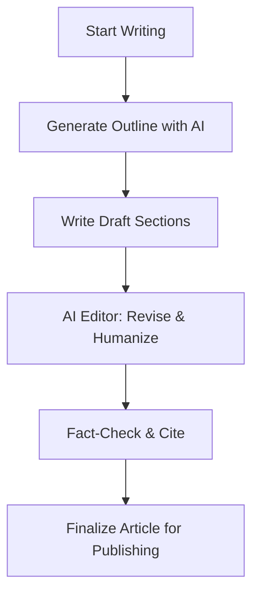

# Executive Summary  

To achieve a high-impact DEV article on an **edge AI/LLM** project and a GitHub repo that drives engagement and job leads, treat the effort as an engineered content pipeline.  Start by defining your **target personas** (e.g. ML/AI engineers, DevOps/homelab enthusiasts, technical managers) and study top examples on DEV and HuggingFace.  Adopt a structure mixing narrative *storytelling* and rigorous technical content – as Paul DeCarlo’s Jetson Orin deep-dive did – and ensure every claim or figure is supported.  Use clear headings, short paragraphs, bullet lists, code snippets, tables and images (charts, diagrams) to break up text and illustrate key points.  Optimize titles and tags for SEO (#AI, #LLM, #Jetson, #EdgeComputing, etc. are essential).  

Implement an AI-assisted writing workflow: break the task into sub-agents (outline generator, draft writer, editor, fact-checker, style coach) with precise prompts and guardrails for a human voice.  For example, use an LLM to **outline** sections given goals and references, another to **draft** section content, then use an **AI editor** to flag clarity issues (“AI as analyzer, not author”) and suggest rephrasing (“maintain my tone”).  Each stage should add to a shared “skill” knowledge base so future agents “remember” earlier fixes.  Incorporate CI gates: run linting/tests (e.g. `pytest`, `ruff`, `pylint`), static analysis (CodeQL, pip-audit, Gitleaks) on each commit to catch errors or leaks early.  Only push the cleaned content once it passes all gates (style check, plagiarism/AI detection, spelling, build/test). 

Meanwhile, prepare the **GitHub repo** as a polished project showcase: English-first README, clear architecture docs, a reproducible demo (e.g. `docker-compose` or a Colab notebook, plus a small HuggingFace Space if possible).  Exclude large binaries, secrets and artifacts via `.gitignore` and remove any tracked junk (`git rm --cached`, or rewrite history if needed).  Include tests, data (small datasets or scripts to fetch data), and benchmark scripts with sample outputs.  Finally, publish and promote: post the article on DEV, replicate content (with canonical links) on Medium/LinkedIn, submit a *Show HN* project to Hacker News, share on r/LocalLLaMA/r/selfhosted/r/homelab, HuggingFace forums, and on a personal tech blog or Hashnode.  Tailor each post (e.g. HN wants a brief “Show HN: [Project]” blurb with links to a runnable demo; LinkedIn may get a summary in more formal tone).  Track metrics: DEV views/comments, GitHub stars/forks/PRs, HuggingFace or Medium reads, and especially any direct contacts or job leads.  

The following sections detail each part of this plan (with cited examples) and conclude with concrete templates and prompts.

## Target Audience Personas  

A high-impact DEV article should speak to multiple developer personas.  Typical readers will include **AI/ML engineers** and data scientists interested in low-cost models, **DevOps and infrastructure engineers** (interested in self-hosting, Docker, CI/CD) and **homelab/NAS enthusiasts**.  You may also reach **technical managers or CTOs** looking to cut cloud costs with edge AI, and **students or hobbyists** learning about LLMs.  (For example, a HuggingFace guide explicitly addressed “If you are a student,” “solo developer,” “coding assistant developer,” etc..) 

- **ML/AI Engineers** want model benchmarks, inference speed, memory usage, and tips on tools (e.g. Ollama vs vLLM vs llama.cpp) and quantization.  
- **DevOps/Edge Engineers** care about system setup: hardware specs (CPU/RAM limits), Dockerization, networking, backups, monitoring and reproducibility.  
- **HomeLab/Hobbyists** enjoy storytelling (“I did this on a Jetson Nano/Pi”) and simple guides on turning old hardware into a useful machine.  
- **Managers/Recruiters** look for evidence of expertise: polished writing, open-source projects, real results, and clear outcomes. (Publishing technical content on DEV raises your profile and frames you as an authority.)  

Tailor your language and examples to these groups.  For instance, early in the article you might motivate the problem (e.g. “Imagine transcribing a media library on a 15W device”) to hook both hobbyists and engineers.  Later sections can dive into architecture and code for the more technical readers.  

## Successful DEV Article Examples  

Study these standout articles for style, structure, and audience fit:

- **Paul DeCarlo, “How GPU-Powered Coding Agents Can Assist in Development…” (Mar 2024)**.  This long-form DEV post begins with a concrete user scenario (transcribing a film library on a small device) and uses first-person narrative.  It is richly structured with headings like “## The Dream” and “## The Historical Pain…” to break the story.  DeCarlo includes background context, bullet lists of specs, code snippets, and tables.  He explains problems clearly (e.g. difficulty compiling PyTorch on aarch64) and shows how an AI agent solved them.  This example shows how technical depth and a human story can coexist.  (*Takeaway:* Start with an engaging hook and use headers/bullets to guide the reader through details.)

- **Jeremy Morgan, “Review: The New NVIDIA Jetson Orin Nano” (Dec 2024)**.  This is a concise review style article. It uses bullet lists for hardware specs and step-by-step setup..  After setup it reports performance on LLM tasks: testing 1B, 3B, and 7B models via Ollama.  The author neatly lists *Pros* and *Cons* in numbered lists.  The tone is accessible (“Absolutely. The Jetson Orin Nano is a fantastic choice…”).  Graphics like images of the device are embedded (with Unsplash credits).  (*Takeaway:* For shorter tutorials, bullet lists and clear subheads (e.g. *“What’s Inside,” “Performance Tests,” “Pros and Cons”*) make info scannable.)

- **Fortitude Omnis, “I built an LLM router that hands you a receipt…” (Aug 2026)**.  This highly technical post mixes narrative and reference design. The title sets a hook about trust and cost savings.  The introduction explains *why* an AI router needs receipts.  The article then shows actual code snippets and a markdown table of example requests and routed models, making the concept concrete.  Headings like *“How it actually decides”* and *“Where the numbers come from”* guide the reader.  The conclusion clearly links to the open-source GitHub and benchmark site.  (*Takeaway:* Don’t shy from including detailed examples (configs, tables) and link to the live code.)

- **Hugging Face Community**.  While not on DEV, HF blog posts (e.g. *“The Best Open Source LLM Models to Run Locally”*) are good references for explanatory content and tool comparisons. They often list **tools & tips** in order (e.g. "Ollama: Best starting point", "vLLM: Best for production serving") and include tables/charts.  Adopt a similar approach: rank tools or models, and explain *why* each is appropriate.

By analyzing these examples, we see successful articles:

- Use **descriptive headings** (the Jetson review: “Performance Tests”, “Final Verdict”; coding-agents: “The Dream”, “Historical Pain”).  
- Present data via **lists and tables** (e.g. performance bullet lists, decision tables).  
- Maintain a **conversational tone** (first/second person, rhetorical questions).  
- **Cite sources or link** where relevant (e.g., [DeCarlo cites NVIDIA’s JetPack docs]) – this builds trust.  

## Article Structure, Tone, and Visuals  

A typical structure for a deep technical DEV article might be:

1. **Title and Subtitle** – Highlight the main achievement or lesson. E.g. *“Turning an Old Jetson Nano into a Robust AI NAS”* or *“Building a Local-First LLM Pipeline on Jetson”*. Use keywords and include outcome.  
2. **Introduction** – Start with a real-world hook or problem statement. For example, DeCarlo’s intro asks readers to imagine *“transcribing a massive Plex library on a device that fits in your hand”*. State the project goal and why it matters (performance, cost savings, learning opportunity).  
3. **Background / Context** – Briefly explain relevant technology: what is Jetson, why use local LLMs, etc. Keep it light for experts but accessible for newcomers.  
4. **System Architecture** – Diagram (e.g. use *Mermaid* or a schematic) of the solution. For example:

   ```mermaid
   flowchart LR
     UserApp --> LLM_Service
     LLM_Service -->|calls| Local_Model
     Local_Model -->|if fails| Cloud_API
     LLM_Service --> Storage
     Storage --> Backup_System
   ```
   *Figure: High-level system architecture.* 

   Include architecture or workflow diagrams (Mermaid or drawn charts) showing components (e.g. Jetson + Docker + LLM server + clients).  

5. **Hardware & Setup** – Describe the hardware (CPU, RAM, etc.) and initial software install. Use bullet lists for specs (see Morgan’s Jetson review). Mention any quirks (e.g. “Jetson Orin’s 8GB RAM is a bottleneck for 7B models”).  
6. **Implementation / Code** – Walk through key parts of the code or configuration. Use inline code blocks and command-line snippets (as in [16] showing `curl` examples). Keep paragraphs short (3–4 sentences) and use lists for steps. For example:  

   - **Docker Build**: List steps or Dockerfile excerpts.  
   - **Model Hosting**: e.g. “We used [Ollama](https://ollama.com/) to run the 8B model on Jetson”.  

7. **Experiments & Results** – Present benchmarks and profiling. Include **tables or charts**: e.g. a table of “Model | Latency | RAM usage” or graphs of CPU/GPU utilization. A sample table:  

   | Model    | Params | RAM (MB) | Latency (ms) | Notes                      |
   |---------|--------|----------|--------------|---------------------------|
   | Llama 2 7B | 7B     | 6000     | 450          | Ran out of memory (crashed) |
   | Qwen-8B  | 8B     | 3000     | 200          | Runs on CPU-only           |
   | GPT-2    | 0.15B  | 800      | 50           | Fast & low RAM             |

   (*Figure: Example performance comparison.*)  

   Also include profiling outputs like flame graphs or memory heatmaps (tools: `py-spy`, [`memray`](https://github.com/bloomberg/memray)). For instance, embed a flamegraph image or diagram showing CPU hotspots. You can generate one with `py-spy record -o profile.svg python3 my_service.py`. Label peaks (e.g. “data loading”, “model inference”).
   
8. **Discussion** – Explain what worked, what failed, and surprises. E.g. “We expected GPU to help more, but the Python overhead was a bottleneck.” Use first-person reflections like DeCarlo does (“The question was: could we actually build that container?”). Summarize key lessons learned.  
9. **Conclusion & Next Steps** – Brief recap (“In summary, an old Jetson can handle 3B-class models locally.”). Point to future work (e.g. “We plan to test with INT8 quantization next”). End with a call to action: link to code repo, invite feedback, etc.

**Tone:** Keep it **technical but engaging**. Use an active, personal voice (“we did X, then Y happened”). Avoid jargon-heavy paragraphs; when technical terms are needed, explain them briefly. Inject some narrative to keep it lively (e.g. personal pronouns or analogies). But also use precise data and logical flow – balance storytelling and documentation.  For style, mimic the voice of experienced technical writers: clear, confident, with a hint of enthusiasm.  De-emphasize generic “AI-speak” fluff; focus on concrete results. As one guide notes, ask AI to “suggest alternative phrasings while maintaining my tone” and “make it concise”.  

**Visual Assets:** Always cite or credit sources. For stock images (like background photos), credit Unsplash or similar if required. Include diagrams (Mermaid recommended for flowcharts/architecture), charts (Matplotlib, Altair, or Excel for quick bar/pie charts), and example screenshots (e.g. terminal output, UI). Keep style consistent. For example, standardize on a color scheme for charts, and keep fonts legible.  Optionally, use Mermaid Gantt or timeline to show project milestones. Here’s a sample agent workflow chart in Mermaid as a placeholder:



Embed any critical visuals *early in paragraphs* (with a brief caption), as this improves reader engagement.  

## Headlines, Tags and SEO Strategy  

Choose a **headline** that is clear and contains key terms. Examples: *“Building a Self-Hosted NAS on a 2018 Jetson Nano”*, *“Local LLMs on Edge: Jetson Nano Benchmark and Deployment”*, or *“I Gave My NAS an AI Brain: Lessons from Jetson Nano”*.  Subtitles can add detail (e.g. “Profiling LLM inference and automation on 4GB devices”). 

Use relevant **tags** on DEV for discoverability. For an edge-LLM project, likely tags include: `#AI`, `#MachineLearning`, `#LLM`, `#DevOps`, `#EdgeComputing`, `#Jetson` or `#NVIDIA`, `#OpenSource`, `#Docker`, `#SelfHosted`, `#Python`. (For example, DEV posts above used tags like `#jetson`, `#nvidia`, `#docker`, `#whisper` and `#ai`, `#opensource`, `#llm`.) These connect your article to topic feeds. Also pick a canonical tag like `#dev` or `#beginners` if it’s an intro guide.

For SEO, ensure the title and headings contain keywords (e.g. “Jetson Nano”, “LLM”).  Write a concise **intro paragraph** that summarizes the key points (DEV displays the first paragraph prominently). Include a few links: your GitHub repo, related docs, or background articles. If cross-posting (e.g. publishing on Medium or a personal blog first), use canonical URLs or the import tools so search engines credit the original source. DEV itself doesn’t support custom canonical URLs, but Medium’s importer will preserve a canonical link to your DEV article (or vice versa).

## AI-Assisted Writing Workflow and Agent Prompts  

To leverage AI while keeping your voice, break writing into distinct tasks and assign each to an “agent” (LLM).  Always **post-edit** and add personal insight. Key stages:

1. **Research Agent** (if needed): Summarize key facts or fetch citations. E.g. prompt: *“Summarize the capabilities of NVIDIA Jetson Nano (2018) and list its specs. Cite sources for power usage and GPU cores.”*  Use results to fill background.  
2. **Outline Agent**: Provide project context and an audience definition, ask for an article outline with sections/headings. Prompt example: *“Create a detailed outline for a DEV Community article about building a NAS on a Jetson Nano with AI. Include sections for intro/problem, hardware setup, software stack, experiments, results, and conclusion.”*  
3. **Section Draft Agent**: For each section of the outline, have the AI write a draft. Example: *“Write a 5-paragraph draft of the ‘Experimental Setup’ section, explaining how to install Docker and LLM tools on Jetson. Use an instructive but friendly tone.”*  
4. **Code & Data Agent**: Generate or explain code snippets. E.g. *“Provide a Dockerfile snippet to install Python3, PyTorch for Jetson, and run an 8GB LLM (mark placeholder if unknown).”*  
5. **Review/Fact-check Agent**: Check claims or facts by querying knowledge. E.g. *“Verify if Jetson Nano’s GPU is Ampere or Maxwell, and correct this sentence.”* Also, use tools like `browser.search` to find citations for technical statements.  
6. **Editor Agent**: Improve style and readability. For instance, give it a paragraph and instruct: *“Rewrite this paragraph in active voice, reducing wordiness and keeping the same meaning.”* Ask it to “suggest alternative phrasing while maintaining my tone”. After it edits, re-insert personal touches or analogies.  
7. **Humanization/Voice Agent**: Use cues from [30]’s advice: *“Evaluate if this text sounds too generic or ‘AI-written.’ If so, add a personal anecdote or reintroduce passive phrasing that adds nuance.”* Also, incorporate at least one direct example or experiment detail only you know.  
8. **Localization Agent**: (As needed) Translate or adapt key terms for target locales. E.g. if writing Russian, convert phrases like “Pull requests” to “запросы на слияние”, or insert local unit references. 

**Prompt Templates (examples):**  

- *Outline Prompt:* “I want to write a detailed article for [persona description, e.g. ‘ML engineers and home-lab enthusiasts’] about [project summary]. Suggest an ordered outline with 5–7 sections (use headings) that covers the story, tech details, and results.”  
- *Generation Prompt:* “Write section **“Experiments**: Describe how we benchmarked inference on the Jetson Nano. Include which LLM models we tested, how we measured latency and memory, and briefly mention any profiling tools (e.g. py-spy). Use bullet points for steps.”  
- *Editing Prompt:* “Here is a draft paragraph. Simplify the language, use active voice, and remove any repetition, but keep it sounding like an engineer explaining a challenge.” (Feed the draft in.)  
- *Style Prompt:* “Ensure the text uses a natural, engaging tone. Replace any overly formal or vague phrases. For example, change ‘it was discovered that’ to ‘we found’.”  
- *Fact-check Prompt:* “Check the factual accuracy: The Jetson Nano (2018) draws under 10 watts. Correct this fact or specify source.”  
- *Localization Prompt:* “Translate the following tech terms into Russian appropriately: ‘edge computing’, ‘bottleneck’, ‘benchmark’.”  

Each prompt should *contextualize* what’s already written to avoid disjoint text. After running the AI prompt, **always review and adjust**. As one writing guide recommends, use AI to flag clarity issues rather than blindly accepting generated text. For instance, if the AI makes the prose too uniform, manually reinsert idioms or softeners (“perhaps”, “often”, metaphors) that make it feel human.  

## Multi-Agent Orchestration & CI Gates  

Implement these checks before any commit or publish step:  

- **Human Voice Check:** Run the draft through an AI-detector or style analyzer (tools like GPTZero, Copyleaks). If flagged, do another human edit.  
- **Pre-commit Hooks:** Use `pre-commit` to enforce formatting (`black`, `ruff`), static typing (`mypy`), and YAML/CI linting (`actionlint`, `hadolint`).  
- **Tests & Benchmarks:** On each push, run unit tests and the demo (e.g. `docker-compose up` smoke test). Include a GitHub Action that rebuilds the Docker image on Jetson architecture (arm64) or runs a colab/test script.  
- **Security Scans:** Use GitHub CodeQL (for code flaws), **Gitleaks** (for secrets in history), **pip-audit** or **safety** (for vulnerable Python libraries), and **Trivy** (for container vulnerabilities).  
- **Style & Spelling:** Lint markdown for readability, grammar, and consistent style. Ensure code samples compile or at least paste correctly (previews in DEV can be used).  

Embed these as CI workflows so any PR must pass all checks. This enforces **article quality and repo hygiene** as in a finished product. As Fortitude Omnis demonstrated, even a clever AI assistant (“Claude Opus 4.6”) needed human oversight – the agent used tools to avoid errors, but a final human review was crucial. Similarly, your gates ensure no critical issue slips through.  

## GitHub Repository Layout & README  

A minimal reproducible project repo might look like:

```
/
├─ README.md
├─ LICENSE
├─ CHANGELOG.md
├─ CODE_OF_CONDUCT.md
├─ .gitignore
├─ /docs/              # design notes, article content (or 'docs/ARTICLE.md')
├─ /src/               # application source code (e.g. service code)
├─ /benchmarks/        # scripts and raw data (e.g. latency logs)
├─ /demo/              # demo notebooks or HuggingFace Space files
├─ /tests/             # unit tests
├─ /examples/          # usage examples or API calls
└─ /scripts/           # helper scripts (e.g. data preparation, profiling)
```

**README.md (English-first):**  Should immediately explain *what* the project is and *why*. For example:

```markdown
# Jetson EdgeNAS: AI-Enhanced Home Server on Jetson Nano  

A project to turn an **old Jetson Nano (2018)** into a **reliable self-hosted NAS** with built-in AI agents for monitoring and diagnostics. We added an AI LLM layer and automated backups, and benchmarked performance to find bottlenecks.

- **Hardware:** Jetson Nano (4GB RAM), SSD or SD storage  
- **Software:** Ubuntu + Docker, Python 3.10, [Ollama](https://ollama.com/) for local LLM  
- **Key features:** Memory profiling, automated recovery scripts, and an AI chatbot for server health checks.  

## Getting Started

1. **Clone the repo:** `git clone https://github.com/username/jetson-edgenas.git`  
2. **Run the demo:** Use `docker-compose up` to launch the NAS services and an LLM API (on x86 or `jetson:latest` image).  
3. **Reproduce benchmarks:** See [`/benchmarks`] for scripts and results (latency logs, flamegraphs).  

## Architecture

```mermaid
flowchart LR
    NAS_Infrastructure --> Docker_Containers
    Docker_Containers --> {LLM_Service, Storage, Backup_Service}
    LLM_Service -->|calls| local-8GB-model
    local-8GB-model -->|if needed| Cloud_API
```

Details on architecture, design decisions, and usage are in `docs/`.  

## Running Tests

```bash
pytest -q
```

> **Note:** Tested on Ubuntu 20.04 (x86_64) and Jetson Nano 4GB (Jetpack 4.6).  

## Contributing

Contributions are welcome! Please see [CONTRIBUTING.md](CONTRIBUTING.md).  

## License

This project is licensed under MIT (see `LICENSE`).  
```

Key points for the README:  
- **Outcome-focused title/summary** (“turn an old Jetson into a server with AI”).
- **Bullet list** of what’s implemented (features, tech stack, results).  
- **Usage examples** or quick-start (installation, demo commands).  
- **Architecture diagram** (Mermaid or image).  
- **Links to benchmarks and docs**.  
- A **short bio of author** can be in the profile, not README. Instead, mention *“Authored by [Name] – more projects at github.com/username”*.  
- *Why it matters:* e.g. “Solves XYZ problem” – helps recruiters see value.

For *hiring conversion*, highlight your role (“I implemented X, optimized Y”), and show professionalism via thorough docs and code quality. Pin the repo on your GitHub profile and include a summary of the project in your GitHub profile README.  

## Reproducible Demo, Benchmarks, Tests  

- **Docker/Compose:** Include a `Dockerfile` (or multi-stage for arm64) and a `docker-compose.yml` that can launch the core services. This lets others run the demo with one command. E.g.:  

   ```yaml
   version: '3.8'
   services:
     app:
       build: .
       image: jetson-edgenas:latest
       ports:
         - "5000:5000"
       volumes:
         - ./storage:/data
       environment:
         - MODEL_NAME="qwen3:8b"
   ```
   A user can clone and `docker-compose up` to reproduce results.

- **HuggingFace Space or Colab:** If you have an LLM component, provide a minimal Gradio/Streamlit app and deploy it on [Hugging Face Spaces](https://huggingface.co/spaces) or Google Colab. Include the Space URL in the README (e.g. “Try the live demo: [HF Space link]”). This dramatically increases engagement.

- **Benchmarks/Data:** Under `/benchmarks`, include scripts (e.g. `benchmark.py`) and any raw output (CPU/RAM usage, time logs). Also provide processed charts or tables in `docs/`. For transparency, include how the data was collected (commands, environment). 

- **Tests:** Add `pytest` tests for any code logic (e.g. data processing functions). At minimum, ensure the demo endpoints work (could use a small sanity-check script). Automate these so continuous integration runs them on every PR.

## Excluding Artifacts and Cleanup  

Keep the Git history clean:

- List common **.gitignore** entries:  
  ```gitignore
  __pycache__/
  *.pyc, *.pyo
  *.log
  .env, *.pem
  *.pt, *.bin, *.ckpt, *.h5  # ML model binaries
  /storage/
  ```
- Do **NOT** commit large files (data dumps, model weights, raw video) – store only code and tiny example data.
- If any sensitive info or large file accidentally got committed, remove it from history. E.g.:  
  ```bash
  git rm --cached secret.key
  git commit -m "Remove secret"
  ```
  For deeper cleanup, [`git filter-repo`](https://github.com/newren/git-filter-repo) or `BFG Repo-Cleaner` can purge big files from all commits.
- In documentation (and CI), note commands to clear caches or volumes (e.g. `docker system prune`). This prevents reproducibility issues.

## Visual Assets and How to Generate Them  

Use plots and diagrams liberally:

- **Charts:** Python (Matplotlib/Seaborn), Altair, or LibreOffice Calc. For example, a bar chart of “Latency vs Model Size” or “Memory usage for 1B vs 8B models”. Export as PNG/SVG with captions.  
- **Flamegraphs:** Use `py-spy` or `flameprof`. Example:  
  ```bash
  py-spy record -o profile.svg -- python3 inference.py
  ```  
  Show the resulting SVG snippet (highlighting long tails for heavy calls).  
- **Memory graphs:** Tools like [memray](https://github.com/bloomberg/memray) can produce snapshots.  
- **Diagrams:** As mentioned, Mermaid code in markdown for architecture or timelines. E.g. a Gantt chart of project phases, or a flow of data through services.  

Embed images in paragraphs and caption them succinctly. Credit data sources if needed.

## Distribution Plan (DEV, HuggingFace, HN, etc.)  

To maximize reach and opportunities, spread the content:

- **DEV** – Primary English article (with technical audience). Share it on X/Twitter and LinkedIn.  
- **Hugging Face** – If relevant (LLMs focus), publish a blog on HF (ask to add “Community Articles” or use their blogging platform) or at least a discussion post in the **Hugging Face forums**. Hugging Face readers (AI/ML) may link to your models or demos.  
- **Hacker News** – Submit as **Show HN: [Project Name]** once the project is working. Title it like: *“Show HN: Self-hosted LLM NAS on Jetson Nano – code & benchmarks”*. Emphasize it’s a **workable hack** (include GitHub link and a quick start). HN readers value originality and concrete deliverables. Avoid marketing language; focus on *“I built/solved this”*. A brief pitch:  
  > “I turned an old Jetson Nano into a self-hosted NAS with built-in local LLM diagnostics. It benchmarks 3B-parameter models and even auto-detects memory leaks. Code is open-source: [repo link].”  
- **Reddit** – Post in relevant subreddits: r/LocalLLaMA (for LLM on local hardware), r/homelab, r/selfhosted. Tailor the title: e.g. *“I benchmarked 10 local LLMs on a Jetson Nano (4GB) – raw results”* or *“An AI-powered NAS on Jetson – here's what broke and how we fixed it”*. Include key numbers/insights and a link to DEV/GitHub. Keep it factual and community-friendly.  
- **LinkedIn** – Write a summary post linking to the DEV article. Use a human tone (“Excited to share our new project…”), highlight impact (“achieved 60% cost savings on inference”), and add relevant hashtags (#AI #EdgeComputing). Encourage discussion by asking a question (“Has anyone tried this at your company?”).  
- **Medium/DEV canonical** – If you post on Medium, use their import tool with the DEV article’s URL to set the canonical link back to DEV, so SEO credit stays there.  
- **Personal Blog/Hashnode** – If you have a blog, you can repost or write a variant (with canonical back to DEV). This broadens reach and links back to your site.  
- **Journal or Conference** – Longer-term, you might turn substantial work into a whitepaper or submit to a practitioner conference.

Each platform has its audience, so tweak the framing: e.g., focus on cost and reliability on Hacker News, on ease-of-setup on Reddit, and on career/innovation angle on LinkedIn. 

## Metrics and Tracking  

Monitor both content and project impact:

- **DEV Stats:** Views, reactions (unicorns 🦄), and comments are visible on the article page. Aim for thousands of views and dozens of positive reactions as benchmarks.  
- **GitHub Engagement:** Stars, forks, watchers and especially pull requests. A popular post often leads to external contributions (PRs, issues).  
- **Hugging Face/Medium:** Claps, likes, number of reads. HF spaces track visitors.  
- **Social Metrics:** Shares, likes, comments on X/LinkedIn/Reddit.  
- **Leads:** Track if people reach out (messages, emails) for freelance or job inquiries. One measure is mentions on personal calendar or email count after publishing. Even offline, note any interview offers or consulting gigs that cite the article.  

Set quantitative goals (e.g. “5k DEV views, 50 GitHub stars, 5 PRs in 2 months”). Use these as feedback to iterate: improve the writing style or tutorial depth if engagement is low.  

## Legal and Ethical Notes  

- **Licensing:** Choose an open-source license (e.g. MIT or Apache 2.0) for your code and model artifacts. Include a `LICENSE` file. If combining components (e.g. model weights, scripts), ensure all parts are redistributable. Cite sources of inspiration or code.  
- **Attribution:** Credit any external code or research you use. For images from Unsplash or other free sources, attribution is polite (as in [39†L37-L44] even though Unsplash does not require it, it’s good practice). For example: “Image: Photo by Glenn Carstens-Peters on Unsplash.”  
- **Disclosure:** Be transparent about AI assistance in writing. While DEV doesn’t forbid AI, many communities frown on fully AI-generated text. In your article or notes, mention *“This article was drafted with the assistance of AI tools, and reviewed by me”*. Similarly, if you use copyrighted charts or data, ensure fair use or permission. DEV’s summary for writing tips even includes a “Disclosure” section.  
- **Ethical Claims:** Only present factual claims. If mentioning performance (e.g. “Jetson ran 3B model in 200ms”), specify conditions. Avoid hype.  
- **Privacy/Security:** If collecting any data (e.g. user logs), note how it’s anonymized. Don’t expose any personal credentials in code.

Adhering to these guidelines not only avoids problems (no takedowns), but signals professionalism to employers/readers.

## Russian Adaptation (Примечания по адаптации на русский)

- While the primary article is in English (for DEV), you can create a **Russian version** later (e.g. for Habr). Adapt not just language but style: Russian tech audiences often prefer a more direct, concise style (“Пиши, сокращай” ethos). Avoid anglicisms where clear Russian equivalents exist. Check Ilyakhov’s advice on clarity and brevity.  
- Consider localizing context: mention popular Russian NAS brands or software if relevant, and local community references (e.g. “хомлабы” community).  
- For Russian posts, use Habr-specific guidelines: they penalize overly AI-like text and value personal experience and humor. (For example, a Habr article on Home NAS that hit 85k views told a first-person “catastrophe-to-solution” story). Incorporate troubleshooting anecdotes (“я … как-то раз нажал…”).  
- Generate separate summaries or key point lists in Russian. You may set up a bilingual repo with `README.ru.md` for Russian readers.  
- Be mindful of tags in Russian platforms (e.g. `#ИИ`, `#Linux`, `#Jetson`, `#ДомашнийNAS`). 

Overall, focus on conveying your *own insights* and *real engineering work*. With the above strategy—strong narrative, thorough examples, well-organized repo, and broad distribution—you’ll maximize impact and demonstrate competence to peers and potential employers.  

