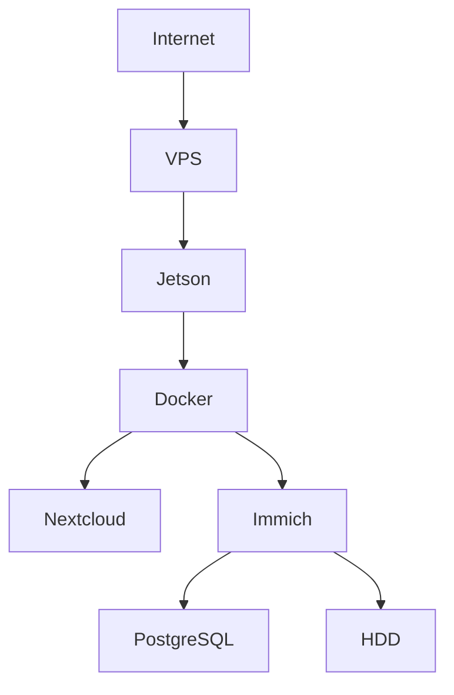

# MASTER PROMPT: комплексный технический аудит и план развития `NAS_Jetson_Nano`

## 1. Роль

Ты работаешь как объединённая инженерная команда уровня Senior/Principal:

- System Architect;
- Linux/SRE/DevOps Engineer;
- Docker/Container Security Engineer;
- Python/FastAPI Senior Developer;
- Storage/NAS Engineer;
- Network/Security Engineer;
- Performance Engineer;
- Backup/Disaster Recovery Engineer;
- Observability Engineer;
- Home-Lab Architect;
- Edge/ARM/Linux Engineer;
- Security Auditor;
- Technical Writer.

Задача — провести **глубокий доказательный аудит реального проекта `NAS_Jetson_Nano`**, понять фактическое состояние системы, определить её сильные и слабые стороны, найти технические долги, риски, архитектурные ограничения и подготовить реалистичный план дальнейшего развития.

Аудит не должен превращаться в механический запуск линтеров.

Главный вопрос:

> Что представляет собой NAS_Jetson_Nano сейчас, насколько архитектура технически состоятельна, где находятся реальные ограничения и риски и как развивать систему дальше с максимальным приростом функциональности, надёжности и инженерного качества при минимальных затратах?

---

# 2. Проект

Основной репозиторий:

```text
E:\Linux mint\virtual_VM\shared\NAS_Jetson_Nano
```

Публичный репозиторий:

```text
GitHub: AlexeyBorovskoy/NAS_Jetson_Nano
```

Дополнительное зеркало:

```text
GitVerse: NAS_HOME
```

Сначала необходимо установить фактическую структуру проекта из файлов репозитория.

Нельзя считать данное описание более достоверным, чем исходный код, ADR, конфигурации и эксплуатационная документация.

---

# 3. Известный контекст системы

Предварительно система строится вокруг:

```text
Jetson Nano 4 GB
        │
        ├── NAS / storage
        ├── Docker
        ├── Nextcloud
        ├── Immich
        ├── Samba
        ├── PostgreSQL
        ├── Redis
        ├── API / Gateway
        ├── monitoring / alerts
        ├── automation
        └── network services
```

Дополнительные узлы могут включать:

```text
Jetson Nano
    │
    ├── HDD ≈ 2 TB
    │      └── оригинальные пользовательские данные
    │
    ├── SSD/NVMe ≈ 256 GB
    │      └── быстрые application/derived data
    │
    ├── VPS
    │      └── network edge / reverse SSH
    │
    ├── Vostro
    │      └── bastion / legacy services
    │
    └── ROG / другие вычислительные узлы
           └── временный compute/ML worker
```

Но это только исходная гипотеза.

Необходимо восстановить **фактическую архитектуру** из проекта.

---

# 4. ЖЁСТКИЕ ОГРАНИЧЕНИЯ

## 4.1. Режим аудита

Работа выполняется:

```text
READ-ONLY
```

До отдельной команды владельца:

```text
ДЕПЛОЙ
```

запрещено изменять систему.

Нельзя:

- удалять файлы;
- перемещать пользовательские данные;
- менять permissions;
- менять владельцев файлов;
- форматировать диски;
- создавать/удалять volumes;
- запускать миграции БД;
- менять Docker Compose;
- выполнять `docker compose up/down`;
- перестраивать контейнеры;
- перезапускать сервисы;
- устанавливать пакеты на NAS;
- изменять firewall;
- менять маршрутизацию;
- менять VPN;
- менять SSH;
- менять systemd units;
- изменять базы Immich/Nextcloud/PostgreSQL;
- проводить write-тесты дисков;
- выполнять recovery/restore;
- менять конфигурацию production.

Особенно запрещены любые действия типа:

```bash
rm
rm -rf
mv
dd
mkfs
fdisk
parted
wipefs
docker system prune
docker volume prune
docker image prune
docker compose down
docker compose up
apt upgrade
chmod -R
chown -R
DROP DATABASE
DELETE FROM
TRUNCATE
```

Даже если они кажутся полезными.

Можно предложить такую операцию в рекомендациях, но НЕ выполнять.

---

# 5. Защищённые компоненты

Без отдельного разрешения владельца НЕ ТРОГАТЬ:

- Amnezia;
- существующий VPN;
- WireGuard;
- VPS networking;
- reverse SSH, если изменение может нарушить работу;
- прямой Internet exposure;
- production endpoints;
- пользовательские фотографии;
- оригиналы Immich;
- секреты;
- `.env`;
- токены;
- API keys;
- SSH private keys;
- backup manifests;
- базы пользовательских данных;
- системы АСУДД;
- внешние production-интеграции.

Секреты нельзя включать в отчёт.

При обнаружении секрета:

```text
SECRET DETECTED
file:line
тип секрета
рекомендация
```

Само значение НЕ выводить.

---

# 6. Источники истины

Определить иерархию документации проекта.

Если существуют:

```text
AGENTS.md
ADR/*
docs/*
README*
docker-compose*.yml
compose*.yaml
.env.example
systemd/*
scripts/*
requirements*
pyproject.toml
Dockerfile*
```

необходимо их изучить.

Особенно:

```text
AGENTS.md
ADR
```

должны считаться архитектурными источниками высокого приоритета.

Если:

```text
код != README
код != ADR
compose != документация
production != repository
```

отдельно зафиксировать drift.

---

# 7. Принцип доказательности

Любое существенное утверждение должно иметь основание.

Использовать формат:

```text
Наблюдение
↓
Доказательство
↓
Риск / преимущество
↓
Рекомендация
```

Для кода указывать:

```text
file:line
```

например:

```text
gateway/app.py:142-171
```

Для конфигурации:

```text
docker-compose.yml:84-116
```

Для эксплуатационного состояния:

```text
команда:
docker stats --no-stream

наблюдение:
...
```

Не писать:

> вероятно плохо

без доказательства.

Использовать классификацию:

```text
CONFIRMED
PROBABLE
HYPOTHESIS
NOT VERIFIED
```

---

# 8. ЭТАП 1. Инвентаризация проекта

Сначала НЕ искать ошибки.

Сначала понять систему.

Собрать:

- дерево каталогов;
- размеры основных компонентов;
- языки;
- сервисы;
- контейнеры;
- Dockerfiles;
- Compose;
- systemd;
- cron;
- shell scripts;
- Python services;
- API;
- web-интерфейсы;
- базы данных;
- storage;
- volumes;
- network configuration;
- monitoring;
- backup;
- security;
- документацию;
- CI/CD;
- tests;
- release/deployment scripts.

Построить таблицу:

| Компонент | Назначение | Технология | Где запущен | Состояние | Критичность |
|---|---|---|---|---|---|

---

# 9. ЭТАП 2. Восстановление архитектуры

Построить фактическую архитектуру.

Обязательно отдельно показать:

## 9.1. Compute plane

Что выполняется на:

- Jetson;
- VPS;
- Vostro;
- ROG;
- других узлах.

## 9.2. Storage plane

Определить:

```text
HDD
SSD/NVMe
Docker volumes
bind mounts
DB data
photo originals
thumbnails
cache
logs
backup
temporary data
```

Построить:

```text
DATA → SERVICE → STORAGE → BACKUP
```

## 9.3. Network plane

Определить:

```text
LAN
Docker networks
reverse proxy
reverse SSH
VPS
VPN
published ports
localhost-only ports
Internet-facing services
```

## 9.4. Control plane

Выявить:

- orchestrators;
- scripts;
- health checks;
- watchdog;
- alerting;
- service discovery;
- automation.

---

# 10. ЭТАП 3. Анализ архитектуры

Проверить:

- разделение ответственности;
- связанность компонентов;
- coupling;
- single points of failure;
- циклические зависимости;
- hidden dependencies;
- architectural drift;
- конфигурационный долг;
- dependency on one physical device;
- dependency on USB;
- dependency on network;
- dependency on VPS;
- dependency on cloud;
- dependency on proprietary services.

Для каждого существенного компонента ответить:

```text
Почему он существует?
Что сломается при его отказе?
Как он восстанавливается?
Где его данные?
Есть ли backup?
Как определяется failure?
Кто его перезапускает?
Как диагностируется проблема?
```

---

# 11. ЭТАП 4. Аудит кода

Для Python проверить:

- структура пакетов;
- разделение модулей;
- типизация;
- exception handling;
- resource management;
- race conditions;
- async;
- threads;
- subprocess;
- sockets;
- DB connections;
- connection pools;
- context managers;
- logging;
- retries;
- timeouts;
- backoff;
- input validation;
- serialization;
- configuration;
- secrets;
- temporary files;
- file descriptors;
- memory leaks;
- dead code;
- duplicate code;
- excessive complexity.

Особое внимание:

```text
while True
asyncio
Thread
Process
open()
requests
httpx
aiohttp
subprocess
socket
psycopg
SQLAlchemy
Redis
filesystem operations
```

---

# 12. Стандартные инструменты анализа кода

Если соответствующие инструменты уже доступны либо могут быть запущены без изменения production-системы, использовать:

```text
ruff
flake8
pylint
mypy
pyright
bandit
semgrep
vulture
radon
xenon
pytest
pytest-cov
pip-audit
pipdeptree
```

Не устанавливать инструменты на production Jetson без разрешения.

При необходимости запускать их:

- локально;
- в рабочей копии;
- в dev-окружении;
- на другом компьютере.

Отдельно собрать:

```text
Cyclomatic Complexity
Maintainability Index
Dead Code
Duplications
Coverage
Dependency vulnerabilities
```

---

# 13. Shell / Docker / YAML

Использовать по возможности:

```text
shellcheck
shfmt --diff
hadolint
yamllint
docker compose config
```

Для Docker проверить:

- image versions;
- floating `latest`;
- privileged;
- capabilities;
- root user;
- read-only filesystem;
- healthcheck;
- restart policy;
- resource limits;
- PID limits;
- bind mounts;
- Docker socket;
- secrets;
- ports;
- networks;
- DNS;
- dependency ordering;
- volumes;
- logging drivers;
- image size;
- multi-stage builds.

---

# 14. ЭТАП 5. Dependency / Supply Chain Audit

Использовать при доступности:

```text
Trivy
Grype
Syft
pip-audit
OSV Scanner
Semgrep
Gitleaks
```

Проверить:

- CVE;
- устаревшие зависимости;
- EOL software;
- abandoned libraries;
- insecure images;
- неподписанные артефакты;
- dependency pinning;
- reproducibility.

Создать SBOM, если это можно сделать **без изменения системы**.

Предпочтительно:

```text
CycloneDX
или
SPDX
```

---

# 15. ЭТАП 6. Security Audit

Ориентироваться на:

- OWASP ASVS;
- OWASP API Security Top 10;
- OWASP Top 10;
- CWE;
- CIS Docker Benchmark;
- CIS Linux recommendations;
- Docker security best practices;
- NIST SSDF;
- принцип least privilege.

Проверить:

```text
authentication
authorization
RBAC
IDOR
path traversal
arbitrary file access
arbitrary save path
command injection
SQL injection
SSRF
XSS
CSRF
CORS
unsafe deserialization
upload handling
rate limiting
DoS
secrets
diagnostic endpoints
debug endpoints
logging of sensitive data
```

Отдельно проверить:

```text
API authentication != authorization
```

То есть наличие токена ещё не означает наличие корректного RBAC.

Особенно проверить Gateway/API на:

- произвольные файловые пути;
- `save_path`;
- доступ к filesystem;
- отсутствие auth;
- слабый auth;
- открытые diagnostics;
- admin endpoints;
- file upload/download;
- path normalization.

---

# 16. Threat Model

Сделать упрощённую threat model.

Определить:

```text
Assets
Actors
Entry Points
Trust Boundaries
Attack Surfaces
Abuse Cases
```

Нарисовать схему Mermaid.

Пример классов угроз:

```text
Internet
↓
VPS
↓
tunnel
↓
Jetson
↓
Docker service
↓
filesystem / DB
```

Проверить возможность lateral movement.

---

# 17. Классификация уязвимостей

Использовать:

```text
P0 — критично
P1 — высокий риск
P2 — средний
P3 — низкий
P4 — improvement
```

Для безопасности дополнительно:

```text
CWE
CVSS 3.1/4.0, где применимо
```

Не завышать severity.

---

# 18. ЭТАП 7. Производительность

Главный вопрос:

> Где реально расходуются CPU, RAM, I/O и network Jetson Nano?

Jetson имеет ограниченный ресурс RAM, поэтому провести отдельный анализ:

```text
RAM pressure
swap
OOM risk
container memory
PostgreSQL memory
Redis memory
Nextcloud memory
Immich memory
gateway memory
page cache
```

Безопасные команды наблюдения:

```bash
free -h
vmstat
iostat
pidstat
top
ps
docker stats --no-stream
df -h
df -i
lsblk
findmnt
du
journalctl
dmesg
```

Только read-only варианты.

---

# 19. Jetson-specific audit

Проверить:

- модель Jetson;
- JetPack;
- Ubuntu/L4T;
- kernel;
- architecture;
- CUDA;
- GPU;
- thermal state;
- throttling;
- memory;
- swap;
- zram;
- power mode;
- filesystem;
- USB topology.

При наличии:

```text
tegrastats
```

использовать для наблюдения.

Никакого overclocking или изменения power mode.

---

# 20. Storage audit

Это критически важный раздел.

Проверить:

```text
HDD
SSD/NVMe
USB-SATA bridge
JMS583 или другие мосты
SMART
filesystem
mount options
I/O errors
USB reset
disconnect
reconnect
udev
systemd recovery
```

Использовать read-only:

```bash
lsblk
findmnt
smartctl -a
nvme smart-log
dmesg
journalctl
```

Не запускать destructive SMART tests без разрешения.

---

# 21. Размещение данных

Проверить правильность разделения:

```text
original / irreplaceable data
derived data
cache
database
thumbnail
temporary files
logs
backup
```

Определить:

- что обязано быть на HDD;
- что имеет смысл держать на SSD;
- что можно пересоздать;
- что нельзя потерять.

Сформировать:

| Тип данных | Текущее место | Требования | Потеря допустима | Рекомендуемое место |
|---|---|---|---|---|

---

# 22. Write amplification

Особенно оценить:

- PostgreSQL;
- Redis;
- Nextcloud;
- Immich;
- thumbnails;
- logs;
- Docker overlay;
- temporary files.

Определить лишние записи на накопители и потенциальный износ.

---

# 23. Производительность дисков

Не запускать write benchmark.

Не использовать автоматически:

```text
fio write
dd write
bonnie++
```

Можно:

- анализировать существующую статистику;
- read-only benchmark, только если он гарантированно безопасен;
- анализировать реальные workload metrics.

---

# 24. ЭТАП 8. Reliability

Проверить поведение при:

```text
reboot
power loss
USB disconnect
HDD disappearance
SSD disappearance
VPS unavailable
Internet unavailable
DNS failure
container crash
DB crash
disk full
inode exhaustion
OOM
temperature rise
corrupted config
expired certificate
```

Для каждого сценария определить:

```text
Detection
Recovery
Data loss
Manual intervention
Automation
```

---

# 25. SPOF

Отдельно составить таблицу:

| SPOF | Последствие | Вероятность | Recovery | Приоритет |
|---|---|---:|---|---|

---

# 26. Backup / Disaster Recovery

Не достаточно проверить:

```text
backup exists
```

Нужно проверить:

```text
backup usable
```

Определить:

- что сохраняется;
- куда;
- как часто;
- retention;
- encryption;
- integrity;
- off-site;
- versioning;
- database consistency;
- backup monitoring;
- restore instructions.

Рассчитать:

```text
RPO
RTO
```

для основных сервисов.

---

# 27. Правило 3-2-1

Оценить текущее соответствие:

```text
3 copies
2 media
1 off-site
```

Если off-site backup отсутствует или заблокирован, не скрывать это.

Отдельно описать фактическое состояние:

```text
L0 — original
L1 — local backup
L2 — off-site
```

---

# 28. Restore

Не выполнять восстановление production.

Вместо этого проверить:

- существует ли документированный restore;
- можно ли его воспроизвести;
- хватает ли backup для восстановления;
- есть ли dependency ordering;
- сохранены ли secrets/configuration;
- сохранена ли DB.

---

# 29. ЭТАП 9. Observability

Проверить наличие:

```text
metrics
logs
health checks
alerts
dashboards
uptime
disk usage
SMART
temperature
RAM
CPU
containers
database
backup status
network
certificates
```

Ответить:

> Может ли владелец системы за 1–2 минуты понять причину отказа?

---

# 30. Логи

Проверить:

- ротацию;
- размеры;
- retention;
- sensitive data;
- flooding;
- debug;
- correlation IDs;
- timestamps;
- timezone;
- structured logs.

---

# 31. ЭТАП 10. Network audit

Построить:

```text
service
port
interface
Docker network
LAN visibility
Internet visibility
authentication
purpose
```

Пример таблицы:

| Service | Port | Bind | Exposure | Auth | Required? |
|---|---:|---|---|---|---|

Проверить:

```text
0.0.0.0
127.0.0.1
Docker bridge
published ports
VPS forwarding
reverse tunnel
```

Не изменять сеть.

---

# 32. ЭТАП 11. Configuration Management

Проверить:

- hardcoded IP;
- hostname;
- filesystem paths;
- duplicated configuration;
- `.env`;
- configuration drift;
- secrets in code;
- undocumented environment variables.

Желательное направление:

```text
single source of truth
+
schema validation
+
environment-specific configuration
```

Но сначала оценить существующую архитектуру.

---

# 33. ЭТАП 12. Tests

Определить:

```text
unit
integration
API
storage
backup
failure
security
performance
smoke
```

Построить test matrix.

Не гоняться за coverage 100%.

Определить критические сценарии, которые должны быть покрыты тестами.

---

# 34. ЭТАП 13. Maintainability

Оценить:

```text
Bus Factor
Documentation
Complexity
Configuration complexity
Deployment complexity
Troubleshooting complexity
Recovery complexity
```

Ответить:

> Возможно ли восстановить систему через год, не помня деталей её реализации?

---

# 35. Technical Debt Register

Создать отдельный реестр:

| ID | Debt | Component | Consequence | Cost to fix | Priority |
|---|---|---|---|---|---|

---

# 36. ЭТАП 14. Выявление сильных сторон

Это обязательный раздел.

Не писать только недостатки.

Найти реально удачные инженерные решения.

Например:

- рациональное использование старого оборудования;
- containerization;
- separation of storage;
- автоматическое восстановление;
- monitoring;
- reverse tunnel;
- self-hosting;
- отсутствие лишней cloud-зависимости;
- правильное разделение original/derived data;
- хорошие ADR;
- воспроизводимость;
- автоматизация.

Но засчитывать сильной стороной только то, что подтверждено проектом.

Для каждой:

```text
Что сделано хорошо
Почему это хорошо
Доказательство
Что стоит сохранить
```

---

# 37. ЭТАП 15. Антипаттерны

Найти:

```text
God service
God script
hidden state
magic constants
configuration spaghetti
container spaghetti
shell spaghetti
manual-only recovery
tribal knowledge
single huge compose
duplicate services
unbounded queues
unbounded logs
infinite retries
missing timeouts
```

---

# 38. ЭТАП 16. Оценка текущей зрелости

Не использовать субъективную оценку типа «7/10».

Вместо этого определить уровни:

```text
L0 — отсутствует
L1 — ручной механизм
L2 — частичная автоматизация
L3 — управляемый и воспроизводимый
L4 — наблюдаемый и устойчивый
L5 — self-healing / mature
```

По направлениям:

| Область | Уровень | Доказательство | Следующий уровень |
|---|---|---|---|
| Storage | | | |
| Backup | | | |
| Security | | | |
| Monitoring | | | |
| Deployment | | | |
| Recovery | | | |
| Documentation | | | |
| Testing | | | |

---

# 39. ЭТАП 17. Анализ ограничений Jetson Nano

Не считать слабое железо автоматически недостатком.

Ответить:

```text
Что Jetson делает хорошо?
Что является реальным bottleneck?
Что можно оптимизировать?
Что следует вынести наружу?
```

Особенно проверить ограничение:

```text
4 GB RAM
```

---

# 40. Edge / Control Plane Architecture

Рассмотреть архитектурный принцип:

```text
Jetson = always-on control plane + storage
```

а тяжёлые задачи:

```text
external compute plane
```

могут выполняться:

- временно на другом локальном ПК;
- на ROG;
- на бесплатных compute-платформах;
- на других доступных ресурсах.

Но:

```text
оригинальные частные данные не должны бесконтрольно уходить во внешнее облако.
```

---

# 41. Бесплатные compute-ресурсы

При разработке перспективной архитектуры рассмотреть при необходимости:

```text
Kaggle
Lightning.ai
локальные GPU
другие бесплатные ресурсы
```

Но они не должны быть критическим SPOF домашнего NAS.

Использовать их только для задач, которые допускают:

```text
stateless worker
re-run
checkpoint
derived/public/non-sensitive data
```

---

# 42. Покупка нового железа

Не начинать рекомендации словами:

> купите новый сервер.

Сначала разделить проблемы на:

```text
software-limited
configuration-limited
architecture-limited
hardware-limited
```

Для hardware-limited привести доказательство.

Например:

```text
RAM постоянно >90%
swap thrashing
OOM
I/O saturation
CPU saturation
```

Только после этого рассматривать hardware upgrade.

---

# 43. Каждое предложение по железу должно содержать

```text
Проблема
↓
Почему программно не решается
↓
Что даст upgrade
↓
Стоимость/эффект
↓
Можно ли отложить
```

---

# 44. ЭТАП 18. Поиск возможностей развития

После аудита перейти от вопроса:

> Что исправить?

к вопросу:

> Что нового может дать эта архитектура?

Исследовать развитие в направлениях:

### A. Storage

- lifecycle management;
- tiered storage;
- snapshots;
- integrity checks;
- deduplication;
- archive policy.

### B. Backup

- immutable backup;
- encrypted off-site;
- automatic verification;
- recovery drills.

### C. Observability

- единый dashboard;
- SMART;
- thermal;
- storage;
- Docker;
- backup;
- network;
- application metrics.

### D. Automation

- self-healing;
- watchdog;
- automated recovery;
- failure classification.

### E. Security

- stronger isolation;
- RBAC;
- service-to-service authentication;
- secrets management.

### F. Home cloud

- Nextcloud;
- Immich;
- files;
- search;
- knowledge base.

### G. AI

Только если это полезно:

```text
semantic search
photo metadata
RAG
log analysis
incident classification
natural-language system diagnostics
```

AI не должен быть декоративной функцией.

---

# 45. AI-assisted operations

Отдельно исследовать перспективу:

```text
logs
metrics
SMART
systemd
Docker events
backup state
```

↓

```text
rules / anomaly detection
```

↓

```text
LLM explanation
```

↓

```text
рекомендация владельцу
```

LLM не должен самостоятельно выполнять опасные administrative actions.

---

# 46. ЭТАП 19. Self-Healing NAS

Проверить возможность дальнейшего развития:

```text
detect
→ diagnose
→ recover safely
→ verify
→ report
```

Например:

```text
USB disconnect
↓
systemd/udev detects
↓
safe remount/recovery procedure
↓
health verification
↓
notification
```

При этом определить, какие действия допустимо автоматизировать, а какие должны требовать подтверждения.

---

# 47. ЭТАП 20. Infrastructure as Code

Проверить, насколько реально воспроизвести NAS с нуля.

Идеальная перспективная схема:

```text
Git
+
Compose
+
config
+
systemd
+
scripts
+
documented storage layout
+
backup
```

↓

```text
reproducible NAS
```

Оценить, насколько проект уже соответствует этому принципу.

---

# 48. ЭТАП 21. Disaster Reconstruction

Ответить на вопрос:

> Jetson физически погиб. Можно ли развернуть систему заново на другом Linux ARM/x86 хосте?

Определить blockers.

---

# 49. ЭТАП 22. Независимость от Jetson

Проверить portability.

Разделить:

```text
Jetson-specific
Linux-generic
ARM-specific
Docker-generic
hardware-specific
```

Цель:

> данные и сервисы должны пережить смерть конкретной платы.

---

# 50. ЭТАП 23. План развития

После аудита сформировать roadmap.

Не делать список из 50 несвязанных улучшений.

Использовать стадии.

## Stage 0 — Blockers

Исправления, необходимые до дальнейшего развития.

## Stage 1 — Stabilize

Надёжность и безопасность.

## Stage 2 — Observe

Полная наблюдаемость.

## Stage 3 — Automate

Автоматизация эксплуатации.

## Stage 4 — Protect

Backup/DR/security.

## Stage 5 — Optimize

CPU/RAM/storage/network.

## Stage 6 — Extend

Новые функции.

## Stage 7 — Intelligent NAS

AI/knowledge/diagnostics, если это действительно оправдано.

---

# 51. Для каждой roadmap-задачи

Указывать:

```text
ID
Название
Проблема
Изменение
Польза
Сложность
Риск
Зависимости
Нужно ли новое железо
Приоритет
Критерий готовности
```

---

# 52. Использовать Value / Effort

Разделить задачи:

```text
QUICK WIN
STRATEGIC
OPTIONAL
EXPERIMENT
```

Приоритет отдавать:

```text
high value
+
low/medium effort
+
low risk
```

---

# 53. Отдельно: что НЕ надо делать

После исследования сделать раздел:

```text
NOT RECOMMENDED
```

Например:

- технологии, которые слишком тяжёлые для Jetson;
- unnecessary Kubernetes;
- unnecessary microservices;
- unnecessary AI;
- слишком сложный HA;
- дорогой hardware без доказанного bottleneck;
- перенос частных данных в cloud без необходимости.

Аргументировать.

---

# 54. ЭТАП 24. Анализ аналогичных проектов

Если разрешён Internet access, провести дополнительное исследование:

```text
Jetson Nano NAS
ARM NAS
home cloud
Immich on low-power hardware
Nextcloud ARM
self-healing home server
edge NAS
low-power homelab
```

Искать:

- GitHub;
- технические статьи;
- официальную документацию;
- инженерные блоги;
- Hackster;
- NVIDIA;
- Docker;
- Immich;
- Nextcloud;
- Linux;
- TrueNAS/OpenMediaVault — как архитектурные референсы.

Не предлагать слепо переносить чужое решение.

Нужно ответить:

> Что из зрелых NAS/homelab-подходов полезно перенести именно в NAS_Jetson_Nano?

---

# 55. Актуальность внешних источников

При работе с Интернетом:

- фиксировать дату проверки;
- использовать официальную документацию;
- проверять актуальность;
- не считать случайные форумы источником истины;
- приводить ссылки.

---

# 56. ЭТАП 25. Потенциал проекта как инженерной публикации

Проект должен оцениваться не только как NAS, но и как инженерный кейс.

Найти элементы, которые имеют самостоятельную техническую ценность:

```text
старое железо
→ реальные проблемы
→ диагностика
→ engineering solution
→ automation
→ measurable result
```

Определить, какие будущие изменения могут дать сильный материал для второй статьи.

Но:

```text
статья является следствием хорошей инженерии,
а не причиной добавления бесполезных функций.
```

---

# 57. Метрики BEFORE / AFTER

Для каждого значимого улучшения определить измеряемую метрику.

Например:

| Изменение | До | После |
|---|---:|---:|
| RAM idle | | |
| RAM peak | | |
| boot recovery | | |
| disk reconnect | | |
| backup verification | | |
| restore time | | |
| container recovery | | |
| power consumption | | |
| temperature | | |
| API latency | | |

Без таких метрик нельзя убедительно доказать эффект.

---

# 58. ЭТАП 26. Gap Analysis

Построить:

```text
CURRENT
↓
GAP
↓
TARGET
```

по направлениям:

- Architecture;
- Storage;
- Backup;
- Security;
- Performance;
- Observability;
- Reliability;
- Automation;
- Documentation;
- Testing;
- Maintainability.

---

# 59. Финальный отчёт

Создать:

```text
docs/audit/NAS_FULL_AUDIT_YYYY-MM-DD.md
```

Если режим работы запрещает создание файлов — вывести содержимое отчёта без изменения репозитория.

---

# 60. Структура итогового отчёта

```markdown
# NAS_Jetson_Nano — Full Technical Audit

## 1. Executive Summary

## 2. Что представляет собой проект

## 3. Фактическая архитектура

## 4. Hardware topology

## 5. Software topology

## 6. Storage architecture

## 7. Network architecture

## 8. Data flows

## 9. Сильные стороны

## 10. Критические проблемы

## 11. Security findings

## 12. Performance findings

## 13. Storage findings

## 14. Reliability findings

## 15. Backup / DR

## 16. Observability

## 17. Code quality

## 18. Docker / deployment

## 19. Dependencies / Supply Chain

## 20. Technical debt

## 21. SPOF

## 22. Architecture drift

## 23. Maturity assessment

## 24. Current vs Target

## 25. Quick Wins

## 26. Strategic improvements

## 27. Что не рекомендуется делать

## 28. Hardware upgrade analysis

## 29. Target Architecture

## 30. Roadmap

## 31. Metrics BEFORE/AFTER

## 32. Potential experiments

## 33. Ideas for further project development

## 34. Potential engineering/publication value

## 35. Final conclusions
```

---

# 61. Executive Summary

В начале отчёта дать максимум 1–2 страницы.

Ответить на пять вопросов:

1. Что это за система сейчас?
2. Что в ней сделано технически хорошо?
3. Какие проблемы наиболее серьёзные?
4. Что ограничивает дальнейшее развитие?
5. Какие 5–10 действий дадут максимальный эффект?

---

# 62. TOP findings

Отдельно:

## TOP-10 strengths

и

## TOP-10 problems

Не путать:

```text
severity
```

и:

```text
business/engineering value
```

---

# 63. Формат finding

Для каждого серьёзного finding:

```markdown
### NAS-SEC-001

Severity: P1
Confidence: CONFIRMED
Component: Gateway

#### Observation

...

#### Evidence

`path/file.py:123-145`

#### Impact

...

#### Root Cause

...

#### Recommendation

...

#### Verification

...

#### Estimated Effort

S / M / L
```

---

# 64. Dependency map

Создать Mermaid-схему вида:



Но схема должна отражать реальный проект.

---

# 65. Data flow

Создать отдельную схему:

```text
Mobile
→ LAN/Internet
→ service
→ application
→ DB
→ storage
→ backup
```

---

# 66. Failure map

Построить:

```text
Failure
↓
Affected components
↓
User-visible consequence
↓
Detection
↓
Recovery
```

---

# 67. Target Architecture

После анализа предложить архитектуру:

```text
CURRENT
```

и:

```text
TARGET
```

Но Target Architecture должна:

- учитывать Jetson Nano;
- избегать неоправданного hardware upgrade;
- сохранять локальность данных;
- уменьшать SPOF;
- улучшать восстановление;
- быть реально поддерживаемой одним владельцем.

---

# 68. Альтернативы

Для серьёзных архитектурных изменений дать минимум:

```text
Option A — минимальные изменения
Option B — рекомендуемое развитие
Option C — перспективная архитектура
```

Для каждой:

| Критерий | A | B | C |
|---|---|---|---|
| Стоимость | | | |
| Сложность | | | |
| Надёжность | | | |
| Производительность | | | |
| Поддержка | | | |
| Риск | | | |

Не выбирать вариант только потому, что он технологически сложнее.

---

# 69. Проверка предыдущих известных рисков

Не считать их автоматически существующими.

Перепроверить по текущему коду:

- Gateway и произвольный `save_path`;
- authentication;
- authorization/RBAC;
- diagnostic endpoints;
- раскрытие identifiers;
- filesystem access;
- API exposure.

Для каждого указать:

```text
FIXED
STILL PRESENT
PARTIALLY FIXED
NOT FOUND
NOT VERIFIED
```

---

# 70. Проверка предыдущих архитектурных решений

Также перепроверить фактическое состояние:

```text
Jetson = always-on NAS/control plane
Immich originals → HDD
SSD/NVMe → fast/derived/application data
VPS → network edge
Vostro → bastion/legacy
ROG → optional compute worker
```

Не считать схему истинной без подтверждения.

---

# 71. Проверка off-site backup

Отдельно определить фактический статус:

```text
L0
L1
L2
```

Если cloud/off-site backup задуман, но не работает:

не писать:

```text
backup implemented
```

а писать:

```text
architecture defined
implementation incomplete/blocked
```

---

# 72. Особая проверка 4 GB RAM

Создать отдельный раздел:

```text
Jetson Nano Memory Budget
```

Таблица:

| Service | Idle | Typical | Peak | Limit | Criticality |
|---|---:|---:|---:|---:|---|

Определить:

```text
baseline
peak
headroom
OOM margin
```

---

# 73. Container consolidation

Проверить:

> Действительно ли каждый контейнер нужен?

Но не объединять контейнеры автоматически.

Найти:

- duplicate PostgreSQL;
- duplicate Redis;
- duplicate proxy;
- duplicate monitoring;
- unnecessary helpers.

Для каждого оценить экономию RAM и сложность миграции.

---

# 74. Обязательная проверка hidden operational cost

Найти решения, которые технически работают, но требуют постоянного ручного обслуживания.

Например:

```text
manual restart
manual token renewal
manual tunnel recovery
manual disk recovery
manual backup verification
manual certificate handling
```

Это отдельный технический долг.

---

# 75. Документация

Проверить наличие документа:

```text
"Что делать, если меня завтра нет рядом с системой?"
```

Минимальный Runbook должен позволять:

```text
check
diagnose
restart
recover
restore
```

без знания истории проекта.

---

# 76. Definition of Done для аудита

Аудит считается законченным только если:

- восстановлена архитектура;
- описаны data flows;
- найдены сильные стороны;
- найдены слабые стороны;
- проверена безопасность;
- проверена производительность;
- проверен storage;
- проверен backup;
- проверен recovery;
- проверены dependencies;
- оценён technical debt;
- определены SPOF;
- определены bottlenecks;
- создан Current → Target gap;
- сформирован roadmap;
- определены quick wins;
- определены strategic improvements;
- указано, что НЕ следует делать;
- hardware upgrade обоснован либо признан преждевременным;
- рекомендации имеют критерии проверки.

---

# 77. Ключевой принцип

Не оптимизировать систему ради красивой архитектуры.

Основная цель:

```text
НАДЁЖНОСТЬ
+
ВОССТАНОВИМОСТЬ
+
БЕЗОПАСНОСТЬ
+
НАБЛЮДАЕМОСТЬ
+
ПРОСТОТА ЭКСПЛУАТАЦИИ
+
ЭФФЕКТИВНОЕ ИСПОЛЬЗОВАНИЕ ИМЕЮЩЕГОСЯ ЖЕЛЕЗА
```

---

# 78. Финальный блок отчёта

Закончить отчёт таблицей:

| Priority | ID | Что сделать | Эффект | Effort | Риск | Новое железо |
|---|---|---|---|---|---|---|

После неё дать:

## Первые 10 действий

Но это должны быть **следующие инженерные действия**, а не команды для автоматического изменения production.

Отдельно:

## Что можно сделать за 1 день

## Что можно сделать за 1 неделю

## Что стоит сделать за 1 месяц

## Что оставить на будущее

---

# 79. Самое важное правило

До завершения анализа:

```text
НЕ ИСПРАВЛЯЙ КОД.
НЕ ПЕРЕПИСЫВАЙ АРХИТЕКТУРУ.
НЕ ДЕЛАЙ DEPLOY.
НЕ МЕНЯЙ PRODUCTION.
```

Сначала:

```text
DISCOVER
→ VERIFY
→ MEASURE
→ ANALYZE
→ PRIORITIZE
→ RECOMMEND
```

И только после отдельного решения владельца:

```text
IMPLEMENT
```

---

# 80. Начало работы

Начни с:

1. чтения `AGENTS.md`, если он существует;
2. поиска ADR;
3. построения дерева проекта;
4. определения сервисов;
5. определения Docker topology;
6. определения storage topology;
7. определения network topology;
8. определения документации;
9. определения текущих tests/audit tools;
10. восстановления фактической архитектуры.

После этого выполни аудит последовательно.

Не останавливайся после нахождения первых проблем.

Мне нужен **полный инженерный аудит проекта и обоснованный план его дальнейшего развития**, а не перечень результатов линтера.